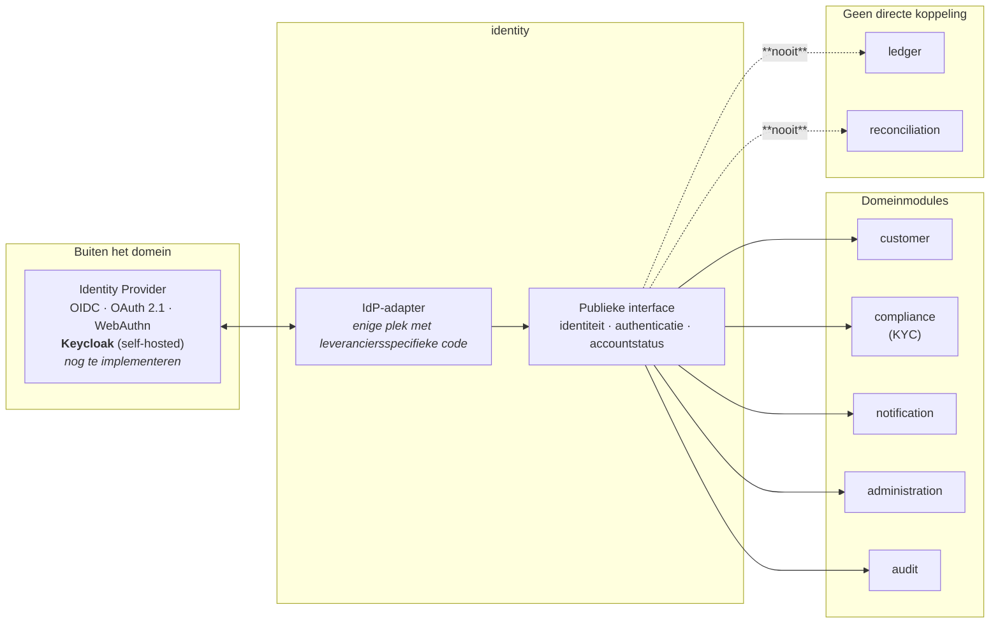
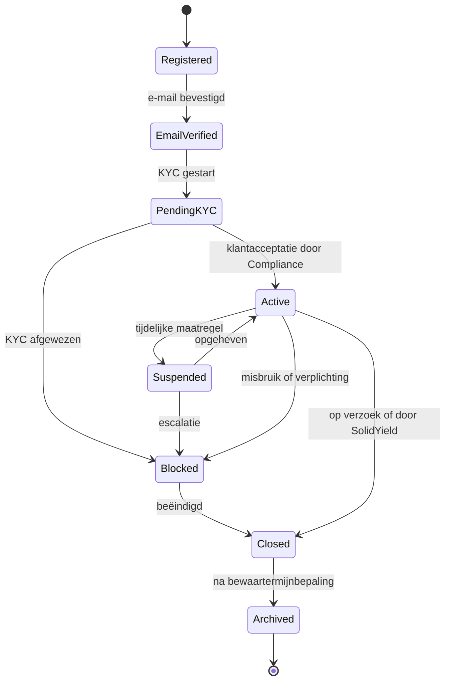

# ADR-0004: Identity & Access Management

* **Status:** **Geaccepteerd** — besluit 8 (2026-08-06, leverancieronafhankelijk model) en
  **besluit 8A** (2026-08-06, gekozen Identity Provider: **Keycloak**, self-hosted)
* **Fase:** **Ontworpen** — niets uit deze ADR is geïmplementeerd of geverifieerd
* **Datum:** 2026-08-06
* **Beslissers:** Security Architect + Tech lead
* **Geraadpleegd:** Product Owner, Compliance, Privacy, Ops

> [!IMPORTANT]
> **Dit besluit wijzigt geen eerdere besluiten.** Het legt het IAM-model vast: identiteit,
> authenticatie, autorisatie, accountlevenscyclus, sessiebeheer, beveiliging, audit en de
> koppeling met KYC. Het is de basis voor registratie, onboarding, inloggen, accountbeheer,
> het beheerportaal en alle beveiligde API's.
>
> **De leverancier is gekozen in besluit 8A** (zie de sectie *Besluit 8A — gekozen Identity
> Provider* hieronder): **Keycloak**, self-hosted, native op Ubuntu Server LTS onder systemd.
> Repository, architectuur en broncode mogen desondanks **geen afhankelijkheid van Keycloak**
> bevatten buiten de IdP-adapter: een andere OIDC-conforme provider moet zonder wijzigingen
> aan de domeinlogica bruikbaar blijven (C-36, T-33).
>
> **Keycloak is nog niet geïnstalleerd, geconfigureerd of geverifieerd.** De keuze is
> genomen; de inrichting bestaat nog niet.

## Probleem

Wie is wie, wie mag wat, en hoe tonen we dat aan — zonder dat de keuze van één
identiteitsleverancier zich in het hele systeem vastbijt?

Bij een financiële dienst is IAM geen randvoorziening: het bepaalt of een onbevoegde bij
geld of persoonsgegevens kan, en of achteraf te reconstrueren valt wie wat deed. Tegelijk is
een identiteitsprovider een leverancier zoals elke andere — vervangbaar moeten blijven is
een architectuureis, geen luxe.

## Uitgangspunten

| # | Uitgangspunt |
|---|---|
| 1 | **Identity is een zelfstandige domeinmodule** |
| 2 | **Authenticatie, autorisatie, KYC en accountbeheer zijn logisch van elkaar gescheiden** |
| 3 | De gekozen architectuur is **leverancieronafhankelijk** |
| 4 | De keuze voor een concrete Identity Provider mag **nooit** leiden tot afhankelijkheid in de domeinlogica |
| 5 | Wallet, Contract, Ledger, Payment, Reconciliation en andere domeinmodules bevatten **geen leveranciersspecifieke IAM-code** |
| 6 | Koppeling verloopt via **adapters en publieke interfaces** |

## Architectuur

**`identity`** is een afzonderlijke module binnen de modulaire monoliet
([ADR-0002](0002-technologiestack.md)). Zij levert **uitsluitend publieke interfaces** aan:

* `customer`
* `compliance`
* `notification`
* `administration`
* `audit`

**Identity communiceert nooit rechtstreeks met `ledger` of `reconciliation`.**

> De **adapter is de enige plek** waar leveranciersspecifieke code mag staan. Vervangen van
> de provider raakt dan één component, niet veertien modules. Deze grens wordt afgedwongen
> met Spring Modulith-tests, net als de overige modulegrenzen.

## Identity Provider

SolidYield gebruikt een **externe OpenID Connect Identity Provider**. Minimale
ondersteuning:

| Eis | |
|---|---|
| **OpenID Connect** | **OAuth 2.1** |
| **WebAuthn** | **Passkeys** |
| **Multi-Factor Authentication** | **Role Based Access Control** |
| **Session Management** | **Device Management** |
| **Audit Logging** | **Provisioning via SCIM** of een gelijkwaardig mechanisme |

---

# Besluit 8A — gekozen Identity Provider

* **Status:** ✅ **besloten 2026-08-06** · **Eigenaar:** Security Architect + Tech Lead + Privacy
* **Fase:** **Ontworpen** — zie *Fasering van besluit 8A* onderaan deze sectie

> [!IMPORTANT]
> **SolidYield kiest Keycloak als Identity Provider voor de MVP.** Keycloak wordt
> **self-hosted** en draait **native op Ubuntu Server LTS onder systemd**.
>
> **Besluit 8 blijft volledig intact.** De adaptergrens, de leverancieronafhankelijkheid van
> de domeinlogica, control **C-36** en dreiging **T-33** blijven onverkort gelden. Dit
> besluit vult in *wie* de provider is, niet *hoe* het domein eraan gekoppeld is.
>
> **Er is nog niets geïnstalleerd, geconfigureerd of geverifieerd.** Zie *Fasering* hieronder.

## 8A.1 Plaatsing

Voor de MVP draait:

* de **productie-instantie** op de bestaande **productie-VPS**;
* de **test-instantie** op de bestaande **test-VPS**.

Dit sluit aan op [ADR-0003](0003-cloudprovider.md); de hostingarchitectuur verandert niet.

### Volledige scheiding tussen productie en test

Productie en test gebruiken **volledig afzonderlijke**:

| | |
|---|---|
| Keycloak-**instanties** | **databases** en **databasegebruikers** |
| **realms** | **clients** |
| **signing keys** | **secrets** |
| **beheerdersaccounts** | **configuraties** |
| **e-mailconfiguraties** | **logging** |
| **monitoring** | **back-ups** |

> **Harde eis:** er worden **geen identitygegevens, accounts, credentials, sleutels of
> sessies** tussen productie en test gedeeld. Dit is dezelfde eis als in
> [ADR-0003](0003-cloudprovider.md) en control **C-24**, nu ook expliciet voor Keycloak.
> Een gekopieerde realm of een gedeelde signing key doorbreekt de omgevingsscheiding
> stilzwijgend (T-27).

## 8A.2 Motivatie

Keycloak is gekozen vanwege:

| | |
|---|---|
| **open source** en **self-hosting** | **volwassenheid** en langjarige stabiliteit |
| grote **community** | goede integratie met **Spring Security** en Kotlin/Spring Boot |
| **OpenID Connect** | **OAuth** |
| **WebAuthn** en **passkeys** | **TOTP** en **recovery codes** |
| **sessiebeheer** | **rollen en groepen** |
| ondersteuning van **meerdere applicaties** | **commerciële ondersteuning** beschikbaar via gespecialiseerde dienstverleners |
| **beperkte vendor lock-in** door gebruik van open standaarden | |

**Aansluiting op de vastgestelde architectuur.** Keycloak draait native op een JVM en past
daarmee op de **Ubuntu/systemd**-architectuur uit [ADR-0002](0002-technologiestack.md) en
[ADR-0003](0003-cloudprovider.md) — waarin containers voor productie, test en de
deploymentarchitectuur bewust zijn uitgesloten. Kandidaten waarvan het **primaire
gedocumenteerde installatiepad containergebaseerd** is, sluiten daar minder goed op aan: dan
draai je óf tegen de vastgelegde architectuur in, óf op een installatiepad dat de leverancier
zelf niet als hoofdroute onderhoudt.

## 8A.3 Afweging van kandidaten

### Keycloak — **gekozen**

| Sterke punten | Aandachtspunten |
|---|---|
| volwassen open-sourceproject | **extra kritieke applicatie om zelf te beheren** |
| native Java-runtime | configuratie en upgrades vragen **specialistische kennis** |
| sterke aansluiting op Spring Security | beschikbaarheid is afhankelijk van **dezelfde productie-VPS** |
| OIDC en OAuth | **SCIM-ondersteuning mag niet als productieklare kernvoorwaarde worden aangenomen** zolang de gebruikte Keycloak-versie deze functie als preview behandelt (zie 8A.7) |
| WebAuthn en geïntegreerde passkeyondersteuning | |
| TOTP en recovery codes | |
| uitgebreide configuratie van authenticatieflows | |
| geschikt voor meerdere applicaties en portals | |

### Authentik — niet gekozen

**Sterke punten:** open source · OIDC · WebAuthn/passkeys · SCIM · moderne en flexibele
authenticatieflows.

**Reden om niet te kiezen:** het gedocumenteerde beheer- en installatiepad is **sterker
containergericht** en sluit daarmee minder goed aan op de vastgestelde native
Ubuntu/systemd-architectuur; de Spring/Kotlin-integratie is minder doorslaggevend dan bij
Keycloak.

### FusionAuth — niet gekozen

**Sterke punten:** self-hosted · OIDC · uitgebreide API · WebAuthn/passkeys.

**Reden om niet te kiezen:** **passkeys/WebAuthn vereisen een geactiveerde
FusionAuth-licentie**. Dat introduceert een aanvullende licentie- en
leveranciersafhankelijkheid op precies de functie die in besluit 8 als **primaire
authenticatiemethode** is vastgelegd, en sluit minder goed aan op de voorkeur voor een
open-sourcebasis met minimale vendor lock-in.

## 8A.4 Architectuurgrens — ongewijzigd

Keycloak wordt **uitsluitend** gekoppeld via:

* **OpenID Connect**;
* **gestandaardiseerde claims**;
* **één Identity Provider-adapter**.

Leveranciersspecifieke Keycloak-code mag **alleen** binnen de adapter of de
infrastructuurconfiguratie voorkomen.

**Buiten die grens niet toegestaan:**

| |
|---|
| **Keycloak-specifieke imports** |
| **Keycloak-datamodellen** |
| **directe toegang tot de Keycloak-database** |
| **Keycloak-specifieke domeinregels** |
| **autorisatie die uitsluitend afhankelijk is van Keycloak-rollen** zonder controle in de SolidYield-servicelaag |

> Control **C-36** en dreiging **T-33** blijven onverkort van toepassing. Dat Keycloak nu de
> gekozen provider is, maakt de adaptergrens **belangrijker, niet minder belangrijk**: juist
> wanneer een leverancier vaststaat, verspreidt leveranciersspecifieke code zich ongemerkt.

## 8A.5 Gebruikersgegevens — hybride eigenaarschap

| Keycloak beheert | SolidYield beheert |
|---|---|
| **authenticatiecredentials** | **klantprofiel** |
| **passkeys/WebAuthn-credentials** | **KYC-status** |
| **wachtwoorden** wanneer van toepassing | **klantacceptatie** |
| **TOTP** | **risicoclassificatie** |
| **identitysessies** | **contracten** · **wallets** · **betalingen** |
| **primaire authenticatie-identificatie** | **domeinrollen en eigenaarschapsregels** |
| **technische IdP-rollen of groepen** | **audit van bedrijfsacties** |

> **Er worden geen financiële domeingegevens in Keycloak opgeslagen.** Contracten, saldi,
> boekingen en KYC-uitkomsten horen in de SolidYield-database — daar gelden de
> onveranderlijkheids-, audit- en bewaareisen uit [ADR-0002](0002-technologiestack.md) en
> [ADR-0008](0008-geld-en-contractstroom.md), en die gelden niet voor een IdP-datastore.

## 8A.6 Passkeys, MFA en recovery — ongewijzigd

Onveranderd uit besluit 8: **passkeys als primaire authenticatiemethode** · meerdere
passkeys per account · **TOTP als fallback** · **SMS uitgesloten** · **verplichte MFA voor
medewerkers** · voorkeur voor hardware security keys of hardware-backed passkeys bij
verhoogde medewerkerrollen.

> De exacte **Keycloak-authenticatieflows zijn nog niet geconfigureerd** en gelden
> uitdrukkelijk **niet als operationeel bewijs**. Zij zijn **nog te implementeren en nog te
> verifiëren** (zie 8A.9).

**Recovery.** Keycloak **recovery codes** mogen als **technische mogelijkheid** worden
onderzocht, maar vormen **niet automatisch** het definitieve operationele recoveryproces. De
bestaande vervolgactie 8 blijft ongewijzigd staan: verlies van alle passkeys · verlies van
TOTP · verlies van e-mailadres · verloren apparaat · medewerkerrecovery · recovery van
accounts met verhoogde rechten. **Er wordt hier geen nieuw recoverybesluit genomen.**

## 8A.7 SCIM en provisioning

* **SCIM of gelijkwaardige provisioning blijft een architectuureis** uit besluit 8.
* De **SCIM-functionaliteit van de gekozen Keycloak-versie moet vóór productie worden
  beoordeeld**.
* Een **previewfunctie wordt niet gebruikt als kritieke productieafhankelijkheid**.
* Voor de MVP kan provisioning plaatsvinden via de **leverancieronafhankelijke adapter** en
  **ondersteunde beheer-API's**.
* Een **definitieve SCIM-inrichting is een vervolgactie**, geen besluit in deze pull request.

## 8A.8 Hosting, beschikbaarheid en operations

Keycloak draait voor de MVP **op dezelfde VPS als de SolidYield-applicatie**. Dat:

* houdt het **beheer eenvoudig**;
* sluit aan op [ADR-0003](0003-cloudprovider.md);
* biedt **geen hoge beschikbaarheid**;
* stelt **Keycloak en de applicatie bloot aan hetzelfde VPS-faalscenario** (T-28) — valt de
  productie-VPS uit, dan is niet alleen de dienst weg maar ook de mogelijkheid om in te
  loggen, inclusief voor beheerders;
* kan bij groei of strengere beschikbaarheidseisen een **herziening naar een afzonderlijke
  VPS** vereisen.

**De huidige hostingarchitectuur verandert niet.**

Keycloak wordt opgenomen in: **systemd-processen** · **monitoring** · **back-upscope** ·
de **patchmanagementvervolgactie** · de **restore- en disaster-recoverytest** ·
**capaciteitsplanning**.

> Concrete systemd-units en operationele configuratie worden hier **niet** beschreven; dat is
> implementatiewerk.

## 8A.9 Fasering van besluit 8A

| Onderdeel | Fase |
|---|---|
| **Keuze van Keycloak als Identity Provider** | ✅ **Besloten · Ontworpen** |
| Keycloak-**installatie** | **Nog te implementeren** |
| **realms** · **clients** | **Nog te implementeren** |
| **passkeyflows** · **MFA** | **Nog te implementeren en nog te verifiëren** |
| **back-ups** · **monitoring** | **Nog te implementeren en nog te verifiëren** |
| **recovery** | **Nog te ontwerpen** (vervolgactie 8) |
| **penetratietest** | **Nog te verifiëren** |
| **adaptertest** (C-36) | **Nog te implementeren en nog te verifiëren** |

> **Geen van deze onderdelen is operationeel.** De keuze is genomen; de inrichting bestaat
> nog niet. Fasen zoals gedefinieerd in
> [`../../compliance/compliance-register.md`](../../compliance/compliance-register.md).

## 8A.10 Dataresidency en privacy

Keycloak valt onder [ADR-0006](0006-dataresidency-en-opslaglocatie.md):

* **opslag en reguliere verwerking vinden in Nederland plaats**;
* **back-ups** vallen onder de eis van een **geografisch gescheiden secundaire locatie
  binnen de EER**;
* er worden **geen productie-identiteiten naar test gekopieerd**;
* **Privacy beoordeelt vóór productie** de persoonsgegevens, logging, bewaartermijnen en
  verwerkerspositie (C-33, C-38);
* Keycloak is **self-hosted** en introduceert daardoor **geen afzonderlijke externe
  IdP-verwerker** voor de kernverwerking;
* **externe e-mail-, support- of andere gekoppelde diensten moeten afzonderlijk worden
  beoordeeld** — een self-hosted IdP die e-mail via een derde partij verstuurt, verplaatst
  die verwerking niet weg, maar naar een ander koppelvlak.

---

## De adaptergrens blijft leidend

> **Toetsbaar gemaakt.** De eis "leverancieronafhankelijk" is pas echt wanneer zij faalt bij
> overtreding: een architectuurtest verbiedt leveranciersspecifieke imports buiten de
> IdP-adapter (vervolgactie 2, control **C-36**). Dat Keycloak is gekozen, verandert daar
> niets aan — een andere OIDC-conforme provider moet zonder wijzigingen aan de domeinlogica
> bruikbaar blijven.

## Authenticatie

### Klanten

| Ondersteund | Niet ondersteund |
|---|---|
| **Passkeys (WebAuthn)** — **primaire methode** | **SMS als primaire MFA** |
| e-mailadres | **social login** |
| wachtwoord — *fallback zolang operationeel nodig* | **gedeelde accounts** |
| **TOTP** | |

**Passkeys zijn de primaire authenticatiemethode.** Wachtwoord is een fallback zolang dat
operationeel nodig is, geen gelijkwaardig alternatief.

### Medewerkers

| Verplicht | Voorkeur | Fallback |
|---|---|---|
| **MFA** · **individuele accounts** | **passkeys** · **hardware security keys** | **TOTP** — uitsluitend als fallback |

## Passkeys

SolidYield ondersteunt **meerdere passkeys per account**. Gebruikers kunnen:

* passkeys **registreren**;
* apparaten **benoemen**;
* apparaten **verwijderen**;
* passkeys **intrekken**.

Passkeys worden **uitsluitend via WebAuthn** beheerd. **Privésleutels verlaten nooit het
apparaat van de gebruiker** — SolidYield bewaart uitsluitend de publieke credential
conform de WebAuthn-standaard.

> Meerdere passkeys per account is geen comfortfunctie maar een herstelmaatregel: met één
> geregistreerd apparaat is verlies van dat apparaat gelijk aan verlies van toegang, en dan
> wordt recovery het zwakste punt van het hele model.

## Wachtwoorden

> **Wanneer SolidYield zelf wachtwoorden opslaat, is Argon2id verplicht. Wanneer
> wachtwoordbeheer door de Identity Provider wordt uitgevoerd, moet die provider
> aantoonbaar minimaal een gelijkwaardig beveiligingsniveau bieden.**

**Argon2id is dus géén onvoorwaardelijke implementatiekeuze** wanneer de Identity Provider
het wachtwoordbeheer verzorgt. Welk van beide gevallen geldt, volgt uit de latere
leverancierskeuze; de **eis** ligt hier vast, de **implementatie** niet.

Dit sluit aan op de formulering in [ADR-0002](0002-technologiestack.md) en
[`../../security/security-principles.md`](../../security/security-principles.md) §2.1.

## MFA

| Doelgroep | Ondersteund / verplicht |
|---|---|
| **Klanten** | ondersteund: **passkeys** · **TOTP** |
| **Medewerkers** | **MFA verplicht** |
| **Accounts met verhoogde rechten** | voorkeur voor **hardware security keys** of **hardware-backed passkeys** |

## Sessiebeheer

Verplicht: **secure cookies** · **HttpOnly** · **SameSite** · **sessierotatie** ·
**centrale sessie-intrekking**.

Gebruikers kunnen:

* **actieve sessies bekijken**;
* **individuele sessies beëindigen**;
* **alle sessies beëindigen**.

## Rollen

| Klant | Medewerkers |
|---|---|
| **Investor** | **Support** · **Compliance Analyst** · **Operations** · **Finance** · **Administrator** · **Security Administrator** · **Auditor** |

> **Geen algemene super administrator.** Er bestaat geen rol die alles mag. `Administrator`
> en `Security Administrator` zijn bewust gescheiden: wie rechten uitdeelt, is niet dezelfde
> als wie de beveiligingsinstellingen en auditconfiguratie beheert. Dat is functiescheiding
> op het gevaarlijkste punt in het systeem.

Uitwerking per rol: [`../../security/access-control.md`](../../security/access-control.md).

## Autorisatie

* **Role Based Access Control (RBAC).**
* Autorisatie wordt **afgedwongen in de servicelaag** — **niet** in controllers, en **niet
  uitsluitend in de frontend**.
* RBAC **plus eigenaarschapscontrole per object**: een rol zegt welke functies iemand mag
  gebruiken, niet op wiens gegevens (dreiging T-05).

**Attribute Based Access Control (ABAC) kan in een latere fase worden toegevoegd zonder de
bestaande RBAC-rollen te vervangen.** ABAC komt dan bovenop RBAC als extra
voorwaardelijkheid (bijvoorbeeld tijd, locatie of dossierbetrokkenheid), niet in plaats van.

## Accountlevenscyclus

| Status | Betekenis |
|---|---|
| **Registered** | account aangemaakt, e-mail nog niet geverifieerd |
| **EmailVerified** | e-mailadres bevestigd |
| **PendingKYC** | wacht op klantacceptatie door Compliance |
| **Active** | volledig bruikbaar |
| **Suspended** | tijdelijk geblokkeerd, herstelbaar |
| **Blocked** | geblokkeerd, niet zelf herstelbaar |
| **Closed** | door de gebruiker of SolidYield beëindigd |
| **Archived** | uitsluitend nog aanwezig voor bewaarplichten |

**Iedere statuswijziging wordt volledig geaudit**: actor, tijdstip, oude status, nieuwe
status, reden en correlation ID.

> **Let op — accountstatus is geen contractstatus.** `Closed` of `Blocked` beëindigt geen
> lopend rendementcontract: vastzetten is onomkeerbaar tot de einddatum
> ([ADR-0008](0008-geld-en-contractstroom.md)). Wat er met een lopend contract gebeurt bij
> blokkade of beëindiging, volgt uit de contractvoorwaarden en is nog uit te werken
> ([`../../product/closed-test-group.md`](../../product/closed-test-group.md), vervolgactie 3).

## Recovery

Ondersteund: **wachtwoordherstel** · **passkey recovery** · **MFA recovery**.

> **Recovery mag nooit een lager beveiligingsniveau hebben dan reguliere authenticatie.**

Dit is het klassieke gat: een systeem met passkeys en verplichte MFA dat via een
e-maillinkje te resetten is, is in de praktijk een systeem met e-mailbeveiliging. Daarom
geldt bij **gevoelige recovery**:

* **identiteitscontrole**;
* **volledige audit**;
* **wachttijd of handmatige beoordeling** wanneer passend.

> **Dit is een eis, geen proces.** Het **operationele recoveryproces** — wie wat doet bij
> welk scenario — moet vóór productie afzonderlijk worden uitgewerkt en vastgesteld. Zie
> *Vervolgactie 8* hieronder voor de scenario's die daarin minimaal aan bod moeten komen.

## KYC

**KYC blijft onderdeel van de `compliance`-module.**

| Identity bepaalt | KYC bepaalt |
|---|---|
| **identiteit** | **klantacceptatie** |
| **authenticatie** | **verificatie** |
| **accountstatus** | **risicobeoordeling** |

**Communicatie verloopt uitsluitend via publieke interfaces of domeinevents.** Identity
weet dus *dat* een account `PendingKYC` of `Active` is; het weet niet *waarom* Compliance
tot dat oordeel kwam, en heeft dat ook niet nodig.

## Logging

Minimaal te loggen: **login** · **logout** · **mislukte login** · **MFA** ·
**passkeyregistratie** · **passkeyverwijdering** · **recovery** · **sessie-intrekking** ·
**accountblokkade** · **rolwijzigingen**.

Iedere securitygebeurtenis bevat minimaal:

| Veld | |
|---|---|
| **actor** | **tijdstip** |
| **correlation ID** | **resultaat** |
| **IP-adres** waar passend | **apparaatinformatie** waar passend |

> **Nooit loggen:** wachtwoorden · passkeys · privésleutels · tokens · secrets.

Securitylogging staat los van technische logging en van de business-audittrail
([ADR-0002](0002-technologiestack.md)).

## Privacy

Identity bewaart **uitsluitend noodzakelijke persoonsgegevens**.

**Identity bewaart nooit:** biometrische gegevens · privésleutels · leesbare wachtwoorden.

**WebAuthn-credentials worden opgeslagen conform de standaard**: publieke sleutel,
credential-ID en metadata. Biometrie bij een passkey wordt op het apparaat van de gebruiker
verwerkt en bereikt SolidYield nooit — dat is precies waarom passkeys hier de primaire
methode zijn.

## Beheer

Beheerders kunnen: accounts **blokkeren** · accounts **deblokkeren** · **sessies
beëindigen** · **MFA resetten** · **rollen wijzigen** · **auditinformatie bekijken**.

> **Maker-checker blijft verplicht voor gevoelige acties** ([ADR-0002](0002-technologiestack.md),
> control **C-26**). Rolwijzigingen en MFA-resets zijn per definitie gevoelig: dat zijn de
> twee handelingen waarmee één beheerder zichzelf of een ander toegang tot alles zou kunnen
> geven.

Het beheerportaal is uitsluitend bereikbaar via **WireGuard**
([ADR-0003](0003-cloudprovider.md)).

## Security

Verplicht: **brute-forcebescherming** · **rate limiting** · **credential
stuffing-bescherming** · **CSRF-bescherming** · **Content Security Policy** · **HSTS** ·
**secure cookies** · **audit logging**.

## Niet toegestaan

| |
|---|
| **SMS-authenticatie** |
| **gedeelde accounts** |
| **hardcoded accounts** |
| **embedded secrets** |
| **autorisatie uitsluitend in de frontend** |
| **leveranciersspecifieke IAM-code in domeinmodules** |

## Motivatie

De zwaarste keuze is niet *welke* provider, maar dat die keuze **omkeerbaar** blijft. Een
identiteitsprovider raakt registratie, inloggen, sessies, rollen, herstel en audit — als
leveranciersspecifieke code zich daarin verspreidt, is vervangen later een
herbouwproject in plaats van een migratie. De adaptergrens is daarom geen nette-code-wens
maar de kern van dit besluit.

De tweede keuze is **passkeys als primaire methode**. Bij een financiële dienst is
phishing het realistische aanvalspad, niet het kraken van een hash. Passkeys zijn
domeingebonden en dus phishing-bestendig; SMS is dat niet en valt daarom af als primaire
MFA, ook al is het gemakkelijker uit te leggen.

## Positieve gevolgen

* De provider is vervangbaar zonder wijziging aan de domeinlogica, en dat is toetsbaar
  gemaakt in plaats van bedoeld.
* Phishing-bestendige authenticatie als standaard, niet als optie.
* Functiescheiding is in het rollenmodel verankerd: er is geen rol die alles mag.
* Recovery is expliciet als aanvalsvlak behandeld in plaats van als randgeval.
* Privésleutels en biometrie komen nooit in ons systeem.

## Negatieve gevolgen

* **Een adapterlaag kost werk en discipline.** De grens houdt alleen wanneer de
  architectuurtest hem afdwingt; zonder die test verwatert hij binnen enkele sprints.
* **Passkeys als primaire methode drukt op de doelgroep.** Deze doelgroep is uitdrukkelijk
  niet technisch (productvisie). Wachtwoord blijft daarom fallback — en zolang die fallback
  bestaat, bepaalt zij mede het feitelijke beveiligingsniveau. Vervalt de fallback niet, dan
  is "passkeys primair" deels een intentie. Dit is een expliciet aandachtspunt voor de
  usabilityvalidatie (A9 in [`../../product/mvp-scope.md`](../../product/mvp-scope.md)).
* **SMS is uitgesloten, en dat kost de meest toegankelijke fallback.** Voor een gebruiker
  zonder smartphone of met lage digitale vaardigheid was SMS vaak de enige werkbare tweede
  factor. Het alternatief moet nu uit TOTP-op-desktop of een hardware security key komen.
  Dat is een **reëel toegankelijkheidsrisico** voor precies de doelgroep die de productvisie
  beschrijft, en het botst met de eis in
  [`../../research/test-group-plan.md`](../../research/test-group-plan.md) dat minimaal twee
  deelnemers met lage digitale vaardigheid vertegenwoordigd zijn.
  *Beperking:* expliciet aandachtspunt in de usabilityvalidatie
  ([`../../security/security-principles.md`](../../security/security-principles.md) §2.2);
  de securitykeuze zelf staat vast — SMS is phishing- en SIM-swapgevoelig en hoort niet bij
  een dienst die geld beheert.
* **Zeven medewerkersrollen bij een team van deze omvang** betekent dat één persoon meerdere
  rollen draagt. Functiescheiding op papier is dan geen functiescheiding in de praktijk;
  maker-checker en auditlogging moeten dat gat dekken, en dat is een organisatorisch punt,
  geen technisch.
* **De IdP is een nieuwe kritieke afhankelijkheid.** Valt hij uit, dan kan niemand inloggen
  — ook beheerders niet. Beschikbaarheid, back-up en een herstelscenario van de IdP zelf
  horen bij de leveranciersselectie (vervolgactie 5).
* **Recovery met wachttijd of handmatige beoordeling kost supportcapaciteit.** Bij een
  besloten testgroep van tien is dat werkbaar; bij opschaling is het dat niet zonder proces.

## Vervolgacties

| # | Actie | Eigenaar |
|---|---|---|
| 1 | `identity`-module met publieke interface en IdP-adapter opzetten; grens vastleggen in Spring Modulith | Tech lead |
| 2 | **Architectuurtest** die leveranciersspecifieke imports buiten de adapter laat falen (C-36) | Tech lead + Security |
| 3 | Rollenmatrix uitwerken tot concrete rechten per endpoint, met negatieve tests per rol | Security + Developers |
| 4 | Recoveryprocedures ontwerpen, inclusief identiteitscontrole, wachttijd en handmatige beoordeling; daarna testen | Security + Support |
| ~~5~~ | ~~Definitieve selectie van de Identity Provider~~ — ✅ **besloten 2026-08-06** (besluit 8A): **Keycloak**, self-hosted. Beschikbaarheid, exit en dataresidency zijn beschreven in 8A.8 en 8A.10; de **privacybeoordeling vóór productie** blijft open (C-38) | Security Architect + Tech lead + Privacy |
| 6 | Sessiebeheerscherm bouwen: actieve sessies tonen, individueel en volledig beëindigen | Developers |
| 7 | Productiegereedheid aantonen (zie hieronder), inclusief penetratietest | Security + Ops |
| 8 | **Operationeel recoveryproces uitwerken en vaststellen vóór productie** (zie hieronder) | Security + Support + Ops |
| 9 | **Toegankelijk alternatief vaststellen** voor gebruikers die geen passkeys kunnen gebruiken (zie hieronder) | Security + UX + PO |
| 10 | **Functiescheidingsmatrix opstellen vóór productie** (zie hieronder) | Security + Compliance |
| 11 | **Keycloak inrichten** (besluit 8A): installatie op productie- en test-VPS onder systemd, gescheiden realms, clients, databases, signing keys en secrets | Tech lead + Ops |
| 12 | **SCIM-functionaliteit van de gekozen Keycloak-versie beoordelen** vóór productie; een previewfunctie wordt geen kritieke productieafhankelijkheid (8A.7) | Tech lead + Security |
| 13 | **Keycloak opnemen in monitoring, back-upscope, patchmanagement, restore-/DR-test en capaciteitsplanning** | Ops |
| 14 | **Privacybeoordeling van Keycloak vóór productie**: persoonsgegevens, logging, bewaartermijnen en verwerkerspositie; externe e-mail- en supportdiensten afzonderlijk beoordelen (8A.10, C-38) | Privacy |

### Vervolgactie 8 — operationeel recoveryproces

Dit besluit legt de **eis** vast (recovery nooit zwakker dan reguliere authenticatie), niet
de oplossing. **Vóór productie moet een operationeel recoveryproces bestaan.** Dat proces
wordt afzonderlijk uitgewerkt en vastgesteld; het is **geen onderdeel van dit besluit**.

Minimaal uit te werken scenario's:

| # | Scenario |
|---|---|
| 1 | **verlies van alle passkeys** |
| 2 | **verlies van TOTP** |
| 3 | **verlies van e-mailadres** |
| 4 | **verloren apparaat** |
| 5 | **recovery van medewerkeraccounts** |
| 6 | **recovery van accounts met verhoogde rechten** |

> Hier staat bewust **geen** concrete oplossing. Per scenario moeten identiteitscontrole,
> wachttijd, handmatige beoordeling en auditvastlegging worden bepaald — dat is
> operationeel ontwerp, geen architectuurbesluit. Zolang dit proces er niet is, is de eis
> "recovery nooit zwakker dan authenticatie" **ontworpen maar niet toetsbaar** (T-30).

### Vervolgactie 9 — toegankelijk alternatief bij geen passkeys

De keuze om **SMS niet te gebruiken** blijft ongewijzigd. Wel geldt: **vóór productie moet
een toegankelijk alternatief zijn vastgesteld** voor gebruikers die geen passkeys kunnen
gebruiken.

> **Dit is een open ontwerpvraag.** Dit besluit neemt géén standpunt in over de oplossing;
> het legt uitsluitend vast dát de vraag vóór productie beantwoord moet zijn. Zie ook het
> toegankelijkheidsrisico onder *Negatieve gevolgen*, aanname A9 in
> [`../../product/mvp-scope.md`](../../product/mvp-scope.md) en RD-30.

### Vervolgactie 10 — functiescheidingsmatrix

Alle rollen uit dit besluit blijven ongewijzigd. **Vóór productie moet een
functiescheidingsmatrix worden opgesteld** waarin is vastgelegd:

* welke rollen **gecombineerd mogen** worden;
* welke combinaties **verboden** zijn;
* hoe **maker-checker wordt toegepast in kleine teams**.

> Dat laatste is de kern van het probleem: bij een team van deze omvang draagt één persoon
> meerdere rollen, en dan is functiescheiding op papier geen functiescheiding in de
> praktijk. De matrix maakt zichtbaar waar dat gebeurt en wat er dan compenseert. Dit
> besluit voegt **geen rollen toe** en wijzigt er geen.

## Productiegereedheid

> **Fase: Ontworpen.** De punten hieronder beschrijven wat vóór productie moet worden
> **aangetoond**. Geen ervan is op dit moment geïmplementeerd of geverifieerd; verificatie
> vindt plaats tijdens implementatie en acceptatie.

Vóór productie moet **aantoonbaar** zijn dat:

| # | |
|---|---|
| 1 | **passkeys functioneren** |
| 2 | **MFA werkt** |
| 3 | **recoveryprocedures zijn getest** |
| 4 | **sessiebeheer werkt** |
| 5 | **auditlogging werkt** |
| 6 | **autorisaties zijn getest** |
| 7 | een **penetratietest** geen kritieke of hoge IAM-bevindingen bevat |

Geborgd als control **C-37**. Deze punten zijn onderdeel van de Go/No-Go vóór start van de
besloten testgroep ([`../../product/closed-test-group.md`](../../product/closed-test-group.md) §10,
voorwaarden 3 en 4).

## Relatie met eerdere besluiten

| Besluit | Verhouding |
|---|---|
| **Besluit 4** | bepaalt **wanneer** echte gebruikers toegang mogen krijgen — pas na bevestiging van de wettelijke grondslag |
| **Besluit 5** | levert de **technische infrastructuur** waarop dit IAM-model draait ([ADR-0002](0002-technologiestack.md), [ADR-0003](0003-cloudprovider.md)) |
| **Besluit 7** | **gebruikt** deze IAM-oplossing tijdens de besloten testgroep |

> **Besluit 8 wijzigt geen van deze besluiten.** Het vult in *hoe* toegang werkt; het zegt
> niets over *of* en *wanneer* die toegang aan echte gebruikers mag worden verleend. Werkende
> authenticatie is geen vrijgave.

## Wat dit besluit uitdrukkelijk níét regelt

**Definitieve keuze van de Identity Provider** · functionele requirements · publieke bèta ·
productieplanning. Deze blijven onderdeel van latere besluiten.

## Gerelateerde besluiten

* Technologiestack: [ADR-0002](0002-technologiestack.md)
* Hosting en omgevingsscheiding: [ADR-0003](0003-cloudprovider.md)
* Dataresidency — geldt ook voor de IdP: [ADR-0006](0006-dataresidency-en-opslaglocatie.md)
* Sleutelbeheer: `ADR-0005` (nog te schrijven)

## Herzieningsmoment

Bij invoering van ABAC, wanneer de wachtwoord-fallback kan vervallen, bij een IAM-bevinding
uit een penetratietest of incident, en — voor besluit 8A — wanneer de beschikbaarheidseisen
een afzonderlijke VPS voor Keycloak vergen of wanneer de SCIM-beoordeling tot een andere
provisioninginrichting leidt.
