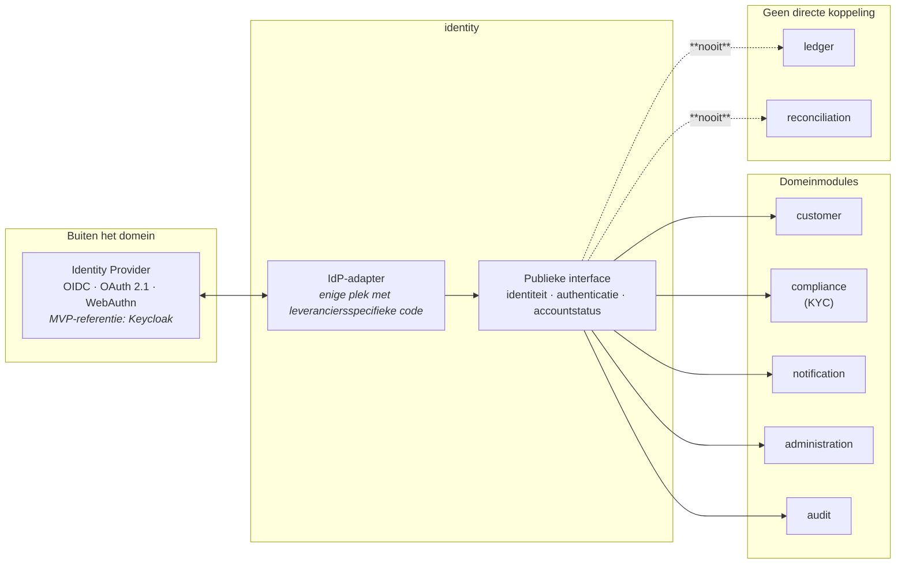
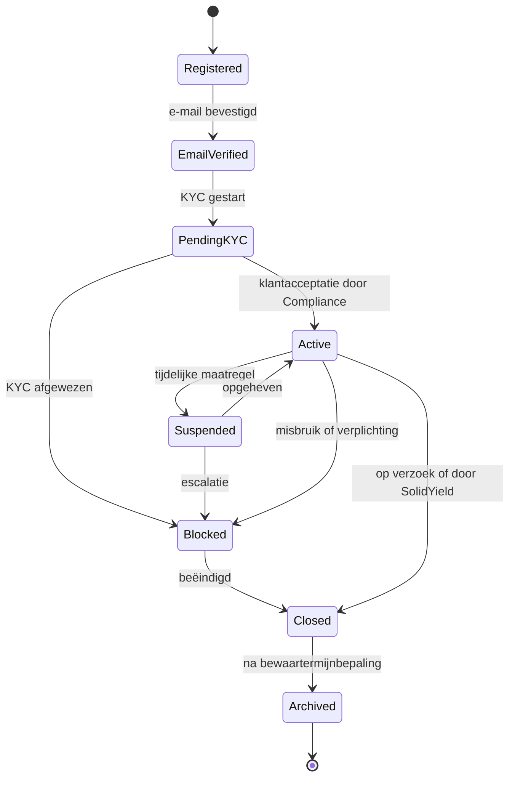

# ADR-0004: Identity & Access Management

* **Status:** **Geaccepteerd** (besluit 8, 2026-08-06) — **leverancieronafhankelijk model**;
  de definitieve keuze van de Identity Provider is **geen onderdeel** van dit besluit
* **Datum:** 2026-08-06
* **Beslissers:** Security Architect + Tech lead
* **Geraadpleegd:** Product Owner, Compliance, Privacy, Ops

> [!IMPORTANT]
> **Dit besluit wijzigt geen eerdere besluiten.** Het legt het IAM-model vast: identiteit,
> authenticatie, autorisatie, accountlevenscyclus, sessiebeheer, beveiliging, audit en de
> koppeling met KYC. Het is de basis voor registratie, onboarding, inloggen, accountbeheer,
> het beheerportaal en alle beveiligde API's.
>
> **De leverancier wordt hier niet gekozen.** **Keycloak geldt uitsluitend als
> referentie-implementatie voor de MVP.** Repository, architectuur en broncode mogen **geen
> afhankelijkheid van Keycloak** bevatten: een andere OIDC-conforme provider moet later
> zonder wijzigingen aan de domeinlogica bruikbaar zijn.

## Probleem

Wie is wie, wie mag wat, en hoe tonen we dat aan — zonder dat de keuze van één
identiteitsleverancier zich in het hele systeem vastbijt?

Bij een financiële dienst is IAM geen randvoorziening: het bepaalt of een onbevoegde bij
geld of persoonsgegevens kan, en of achteraf te reconstrueren valt wie wat deed. Tegelijk is
een identiteitsprovider een leverancier zoals elke andere — vervangbaar moeten blijven is
een architectuureis, geen luxe.

## Uitgangspunten

| # | Uitgangspunt |
|---|---|
| 1 | **Identity is een zelfstandige domeinmodule** |
| 2 | **Authenticatie, autorisatie, KYC en accountbeheer zijn logisch van elkaar gescheiden** |
| 3 | De gekozen architectuur is **leverancieronafhankelijk** |
| 4 | De keuze voor een concrete Identity Provider mag **nooit** leiden tot afhankelijkheid in de domeinlogica |
| 5 | Wallet, Contract, Ledger, Payment, Reconciliation en andere domeinmodules bevatten **geen leveranciersspecifieke IAM-code** |
| 6 | Koppeling verloopt via **adapters en publieke interfaces** |

## Architectuur

**`identity`** is een afzonderlijke module binnen de modulaire monoliet
([ADR-0002](0002-technologiestack.md)). Zij levert **uitsluitend publieke interfaces** aan:

* `customer`
* `compliance`
* `notification`
* `administration`
* `audit`

**Identity communiceert nooit rechtstreeks met `ledger` of `reconciliation`.**

> De **adapter is de enige plek** waar leveranciersspecifieke code mag staan. Vervangen van
> de provider raakt dan één component, niet veertien modules. Deze grens wordt afgedwongen
> met Spring Modulith-tests, net als de overige modulegrenzen.

## Identity Provider

SolidYield gebruikt een **externe OpenID Connect Identity Provider**. Minimale
ondersteuning:

| Eis | |
|---|---|
| **OpenID Connect** | **OAuth 2.1** |
| **WebAuthn** | **Passkeys** |
| **Multi-Factor Authentication** | **Role Based Access Control** |
| **Session Management** | **Device Management** |
| **Audit Logging** | **Provisioning via SCIM** of een gelijkwaardig mechanisme |

### De leverancier is nog niet gekozen

**Keycloak geldt uitsluitend als referentie-implementatie voor de MVP** — een concrete
invulling om tegen te ontwikkelen en te testen, niet een vastgelegde keuze.

* De **definitieve selectie van de Identity Provider is geen onderdeel van dit besluit** en
  blijft een later besluit.
* **Repository, architectuur en broncode bevatten geen afhankelijkheid van Keycloak.**
* Een andere OIDC-conforme provider moet **zonder wijzigingen aan de domeinlogica** kunnen
  worden gebruikt.

> **Toetsbaar gemaakt.** De eis "leverancieronafhankelijk" is pas echt wanneer zij faalt bij
> overtreding: een architectuurtest verbiedt leveranciersspecifieke imports buiten de
> IdP-adapter (vervolgactie 2, control **C-36**).

## Authenticatie

### Klanten

| Ondersteund | Niet ondersteund |
|---|---|
| **Passkeys (WebAuthn)** — **primaire methode** | **SMS als primaire MFA** |
| e-mailadres | **social login** |
| wachtwoord — *fallback zolang operationeel nodig* | **gedeelde accounts** |
| **TOTP** | |

**Passkeys zijn de primaire authenticatiemethode.** Wachtwoord is een fallback zolang dat
operationeel nodig is, geen gelijkwaardig alternatief.

### Medewerkers

| Verplicht | Voorkeur | Fallback |
|---|---|---|
| **MFA** · **individuele accounts** | **passkeys** · **hardware security keys** | **TOTP** — uitsluitend als fallback |

## Passkeys

SolidYield ondersteunt **meerdere passkeys per account**. Gebruikers kunnen:

* passkeys **registreren**;
* apparaten **benoemen**;
* apparaten **verwijderen**;
* passkeys **intrekken**.

Passkeys worden **uitsluitend via WebAuthn** beheerd. **Privésleutels verlaten nooit het
apparaat van de gebruiker** — SolidYield bewaart uitsluitend de publieke credential
conform de WebAuthn-standaard.

> Meerdere passkeys per account is geen comfortfunctie maar een herstelmaatregel: met één
> geregistreerd apparaat is verlies van dat apparaat gelijk aan verlies van toegang, en dan
> wordt recovery het zwakste punt van het hele model.

## Wachtwoorden

> **Wanneer SolidYield zelf wachtwoorden opslaat, is Argon2id verplicht. Wanneer
> wachtwoordbeheer door de Identity Provider wordt uitgevoerd, moet die provider
> aantoonbaar minimaal een gelijkwaardig beveiligingsniveau bieden.**

**Argon2id is dus géén onvoorwaardelijke implementatiekeuze** wanneer de Identity Provider
het wachtwoordbeheer verzorgt. Welk van beide gevallen geldt, volgt uit de latere
leverancierskeuze; de **eis** ligt hier vast, de **implementatie** niet.

Dit sluit aan op de formulering in [ADR-0002](0002-technologiestack.md) en
[`../../security/security-principles.md`](../../security/security-principles.md) §2.1.

## MFA

| Doelgroep | Ondersteund / verplicht |
|---|---|
| **Klanten** | ondersteund: **passkeys** · **TOTP** |
| **Medewerkers** | **MFA verplicht** |
| **Accounts met verhoogde rechten** | voorkeur voor **hardware security keys** of **hardware-backed passkeys** |

## Sessiebeheer

Verplicht: **secure cookies** · **HttpOnly** · **SameSite** · **sessierotatie** ·
**centrale sessie-intrekking**.

Gebruikers kunnen:

* **actieve sessies bekijken**;
* **individuele sessies beëindigen**;
* **alle sessies beëindigen**.

## Rollen

| Klant | Medewerkers |
|---|---|
| **Investor** | **Support** · **Compliance Analyst** · **Operations** · **Finance** · **Administrator** · **Security Administrator** · **Auditor** |

> **Geen algemene super administrator.** Er bestaat geen rol die alles mag. `Administrator`
> en `Security Administrator` zijn bewust gescheiden: wie rechten uitdeelt, is niet dezelfde
> als wie de beveiligingsinstellingen en auditconfiguratie beheert. Dat is functiescheiding
> op het gevaarlijkste punt in het systeem.

Uitwerking per rol: [`../../security/access-control.md`](../../security/access-control.md).

## Autorisatie

* **Role Based Access Control (RBAC).**
* Autorisatie wordt **afgedwongen in de servicelaag** — **niet** in controllers, en **niet
  uitsluitend in de frontend**.
* RBAC **plus eigenaarschapscontrole per object**: een rol zegt welke functies iemand mag
  gebruiken, niet op wiens gegevens (dreiging T-05).

**Attribute Based Access Control (ABAC) kan in een latere fase worden toegevoegd zonder de
bestaande RBAC-rollen te vervangen.** ABAC komt dan bovenop RBAC als extra
voorwaardelijkheid (bijvoorbeeld tijd, locatie of dossierbetrokkenheid), niet in plaats van.

## Accountlevenscyclus

| Status | Betekenis |
|---|---|
| **Registered** | account aangemaakt, e-mail nog niet geverifieerd |
| **EmailVerified** | e-mailadres bevestigd |
| **PendingKYC** | wacht op klantacceptatie door Compliance |
| **Active** | volledig bruikbaar |
| **Suspended** | tijdelijk geblokkeerd, herstelbaar |
| **Blocked** | geblokkeerd, niet zelf herstelbaar |
| **Closed** | door de gebruiker of SolidYield beëindigd |
| **Archived** | uitsluitend nog aanwezig voor bewaarplichten |

**Iedere statuswijziging wordt volledig geaudit**: actor, tijdstip, oude status, nieuwe
status, reden en correlation ID.

> **Let op — accountstatus is geen contractstatus.** `Closed` of `Blocked` beëindigt geen
> lopend rendementcontract: vastzetten is onomkeerbaar tot de einddatum
> ([ADR-0008](0008-geld-en-contractstroom.md)). Wat er met een lopend contract gebeurt bij
> blokkade of beëindiging, volgt uit de contractvoorwaarden en is nog uit te werken
> ([`../../product/closed-test-group.md`](../../product/closed-test-group.md), vervolgactie 3).

## Recovery

Ondersteund: **wachtwoordherstel** · **passkey recovery** · **MFA recovery**.

> **Recovery mag nooit een lager beveiligingsniveau hebben dan reguliere authenticatie.**

Dit is het klassieke gat: een systeem met passkeys en verplichte MFA dat via een
e-maillinkje te resetten is, is in de praktijk een systeem met e-mailbeveiliging. Daarom
geldt bij **gevoelige recovery**:

* **identiteitscontrole**;
* **volledige audit**;
* **wachttijd of handmatige beoordeling** wanneer passend.

## KYC

**KYC blijft onderdeel van de `compliance`-module.**

| Identity bepaalt | KYC bepaalt |
|---|---|
| **identiteit** | **klantacceptatie** |
| **authenticatie** | **verificatie** |
| **accountstatus** | **risicobeoordeling** |

**Communicatie verloopt uitsluitend via publieke interfaces of domeinevents.** Identity
weet dus *dat* een account `PendingKYC` of `Active` is; het weet niet *waarom* Compliance
tot dat oordeel kwam, en heeft dat ook niet nodig.

## Logging

Minimaal te loggen: **login** · **logout** · **mislukte login** · **MFA** ·
**passkeyregistratie** · **passkeyverwijdering** · **recovery** · **sessie-intrekking** ·
**accountblokkade** · **rolwijzigingen**.

Iedere securitygebeurtenis bevat minimaal:

| Veld | |
|---|---|
| **actor** | **tijdstip** |
| **correlation ID** | **resultaat** |
| **IP-adres** waar passend | **apparaatinformatie** waar passend |

> **Nooit loggen:** wachtwoorden · passkeys · privésleutels · tokens · secrets.

Securitylogging staat los van technische logging en van de business-audittrail
([ADR-0002](0002-technologiestack.md)).

## Privacy

Identity bewaart **uitsluitend noodzakelijke persoonsgegevens**.

**Identity bewaart nooit:** biometrische gegevens · privésleutels · leesbare wachtwoorden.

**WebAuthn-credentials worden opgeslagen conform de standaard**: publieke sleutel,
credential-ID en metadata. Biometrie bij een passkey wordt op het apparaat van de gebruiker
verwerkt en bereikt SolidYield nooit — dat is precies waarom passkeys hier de primaire
methode zijn.

## Beheer

Beheerders kunnen: accounts **blokkeren** · accounts **deblokkeren** · **sessies
beëindigen** · **MFA resetten** · **rollen wijzigen** · **auditinformatie bekijken**.

> **Maker-checker blijft verplicht voor gevoelige acties** ([ADR-0002](0002-technologiestack.md),
> control **C-26**). Rolwijzigingen en MFA-resets zijn per definitie gevoelig: dat zijn de
> twee handelingen waarmee één beheerder zichzelf of een ander toegang tot alles zou kunnen
> geven.

Het beheerportaal is uitsluitend bereikbaar via **WireGuard**
([ADR-0003](0003-cloudprovider.md)).

## Security

Verplicht: **brute-forcebescherming** · **rate limiting** · **credential
stuffing-bescherming** · **CSRF-bescherming** · **Content Security Policy** · **HSTS** ·
**secure cookies** · **audit logging**.

## Niet toegestaan

| |
|---|
| **SMS-authenticatie** |
| **gedeelde accounts** |
| **hardcoded accounts** |
| **embedded secrets** |
| **autorisatie uitsluitend in de frontend** |
| **leveranciersspecifieke IAM-code in domeinmodules** |

## Motivatie

De zwaarste keuze is niet *welke* provider, maar dat die keuze **omkeerbaar** blijft. Een
identiteitsprovider raakt registratie, inloggen, sessies, rollen, herstel en audit — als
leveranciersspecifieke code zich daarin verspreidt, is vervangen later een
herbouwproject in plaats van een migratie. De adaptergrens is daarom geen nette-code-wens
maar de kern van dit besluit.

De tweede keuze is **passkeys als primaire methode**. Bij een financiële dienst is
phishing het realistische aanvalspad, niet het kraken van een hash. Passkeys zijn
domeingebonden en dus phishing-bestendig; SMS is dat niet en valt daarom af als primaire
MFA, ook al is het gemakkelijker uit te leggen.

## Positieve gevolgen

* De provider is vervangbaar zonder wijziging aan de domeinlogica, en dat is toetsbaar
  gemaakt in plaats van bedoeld.
* Phishing-bestendige authenticatie als standaard, niet als optie.
* Functiescheiding is in het rollenmodel verankerd: er is geen rol die alles mag.
* Recovery is expliciet als aanvalsvlak behandeld in plaats van als randgeval.
* Privésleutels en biometrie komen nooit in ons systeem.

## Negatieve gevolgen

* **Een adapterlaag kost werk en discipline.** De grens houdt alleen wanneer de
  architectuurtest hem afdwingt; zonder die test verwatert hij binnen enkele sprints.
* **Passkeys als primaire methode drukt op de doelgroep.** Deze doelgroep is uitdrukkelijk
  niet technisch (productvisie). Wachtwoord blijft daarom fallback — en zolang die fallback
  bestaat, bepaalt zij mede het feitelijke beveiligingsniveau. Vervalt de fallback niet, dan
  is "passkeys primair" deels een intentie. Dit is een expliciet aandachtspunt voor de
  usabilityvalidatie (A9 in [`../../product/mvp-scope.md`](../../product/mvp-scope.md)).
* **SMS is uitgesloten, en dat kost de meest toegankelijke fallback.** Voor een gebruiker
  zonder smartphone of met lage digitale vaardigheid was SMS vaak de enige werkbare tweede
  factor. Het alternatief moet nu uit TOTP-op-desktop of een hardware security key komen.
  Dat is een **reëel toegankelijkheidsrisico** voor precies de doelgroep die de productvisie
  beschrijft, en het botst met de eis in
  [`../../research/test-group-plan.md`](../../research/test-group-plan.md) dat minimaal twee
  deelnemers met lage digitale vaardigheid vertegenwoordigd zijn.
  *Beperking:* expliciet aandachtspunt in de usabilityvalidatie
  ([`../../security/security-principles.md`](../../security/security-principles.md) §2.2);
  de securitykeuze zelf staat vast — SMS is phishing- en SIM-swapgevoelig en hoort niet bij
  een dienst die geld beheert.
* **Zeven medewerkersrollen bij een team van deze omvang** betekent dat één persoon meerdere
  rollen draagt. Functiescheiding op papier is dan geen functiescheiding in de praktijk;
  maker-checker en auditlogging moeten dat gat dekken, en dat is een organisatorisch punt,
  geen technisch.
* **De IdP is een nieuwe kritieke afhankelijkheid.** Valt hij uit, dan kan niemand inloggen
  — ook beheerders niet. Beschikbaarheid, back-up en een herstelscenario van de IdP zelf
  horen bij de leveranciersselectie (vervolgactie 5).
* **Recovery met wachttijd of handmatige beoordeling kost supportcapaciteit.** Bij een
  besloten testgroep van tien is dat werkbaar; bij opschaling is het dat niet zonder proces.

## Vervolgacties

| # | Actie | Eigenaar |
|---|---|---|
| 1 | `identity`-module met publieke interface en IdP-adapter opzetten; grens vastleggen in Spring Modulith | Tech lead |
| 2 | **Architectuurtest** die leveranciersspecifieke imports buiten de adapter laat falen (C-36) | Tech lead + Security |
| 3 | Rollenmatrix uitwerken tot concrete rechten per endpoint, met negatieve tests per rol | Security + Developers |
| 4 | Recoveryprocedures ontwerpen, inclusief identiteitscontrole, wachttijd en handmatige beoordeling; daarna testen | Security + Support |
| 5 | **Definitieve selectie van de Identity Provider** — inclusief beschikbaarheid, exit, verwerkersovereenkomst en dataresidency (ADR-0006) | Security Architect + Tech lead + Privacy |
| 6 | Sessiebeheerscherm bouwen: actieve sessies tonen, individueel en volledig beëindigen | Developers |
| 7 | Productiegereedheid aantonen (zie hieronder), inclusief penetratietest | Security + Ops |

## Productiegereedheid

Vóór productie moet **aantoonbaar** zijn dat:

| # | |
|---|---|
| 1 | **passkeys functioneren** |
| 2 | **MFA werkt** |
| 3 | **recoveryprocedures zijn getest** |
| 4 | **sessiebeheer werkt** |
| 5 | **auditlogging werkt** |
| 6 | **autorisaties zijn getest** |
| 7 | een **penetratietest** geen kritieke of hoge IAM-bevindingen bevat |

Geborgd als control **C-37**. Deze punten zijn onderdeel van de Go/No-Go vóór start van de
besloten testgroep ([`../../product/closed-test-group.md`](../../product/closed-test-group.md) §10,
voorwaarden 3 en 4).

## Relatie met eerdere besluiten

| Besluit | Verhouding |
|---|---|
| **Besluit 4** | bepaalt **wanneer** echte gebruikers toegang mogen krijgen — pas na bevestiging van de wettelijke grondslag |
| **Besluit 5** | levert de **technische infrastructuur** waarop dit IAM-model draait ([ADR-0002](0002-technologiestack.md), [ADR-0003](0003-cloudprovider.md)) |
| **Besluit 7** | **gebruikt** deze IAM-oplossing tijdens de besloten testgroep |

> **Besluit 8 wijzigt geen van deze besluiten.** Het vult in *hoe* toegang werkt; het zegt
> niets over *of* en *wanneer* die toegang aan echte gebruikers mag worden verleend. Werkende
> authenticatie is geen vrijgave.

## Wat dit besluit uitdrukkelijk níét regelt

**Definitieve keuze van de Identity Provider** · functionele requirements · publieke bèta ·
productieplanning. Deze blijven onderdeel van latere besluiten.

## Gerelateerde besluiten

* Technologiestack: [ADR-0002](0002-technologiestack.md)
* Hosting en omgevingsscheiding: [ADR-0003](0003-cloudprovider.md)
* Dataresidency — geldt ook voor de IdP: [ADR-0006](0006-dataresidency-en-opslaglocatie.md)
* Sleutelbeheer: `ADR-0005` (nog te schrijven)

## Herzieningsmoment

Bij de definitieve selectie van de Identity Provider, bij invoering van ABAC, wanneer de
wachtwoord-fallback kan vervallen, en bij een IAM-bevinding uit een penetratietest of
incident.
