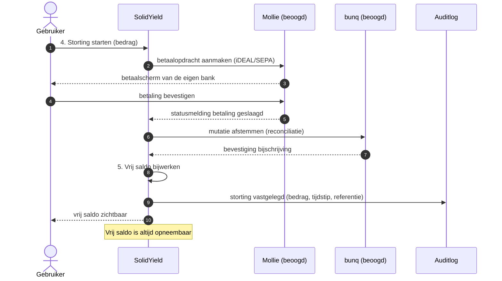
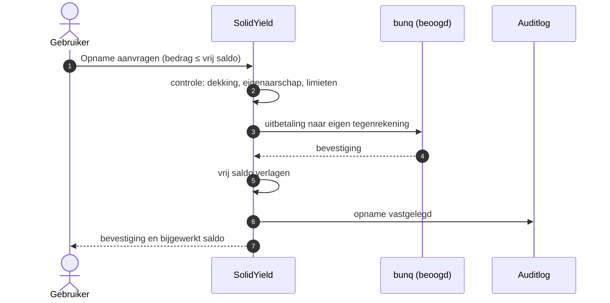
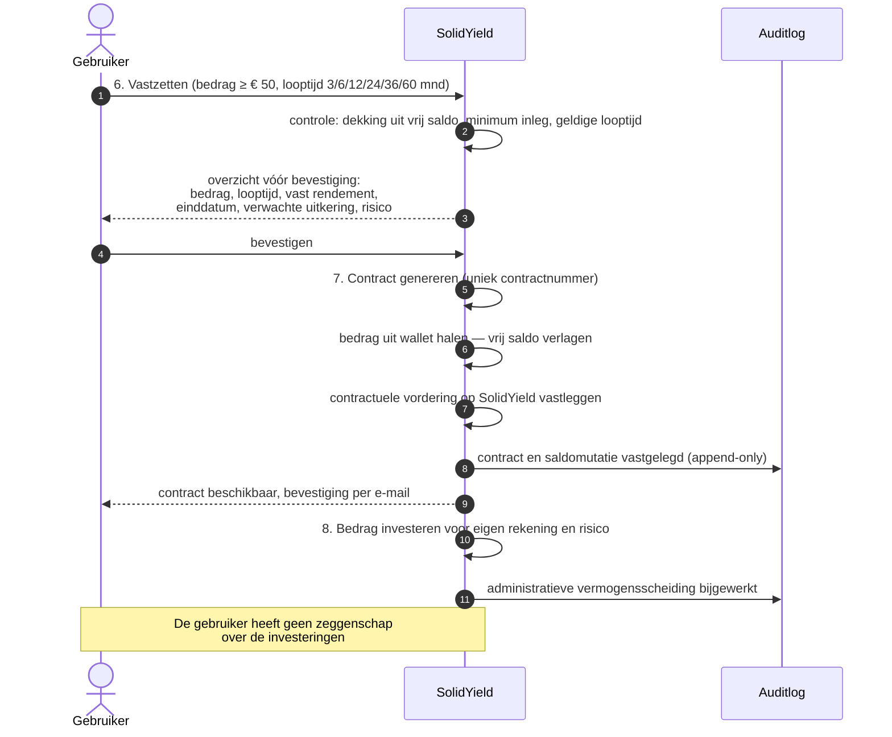
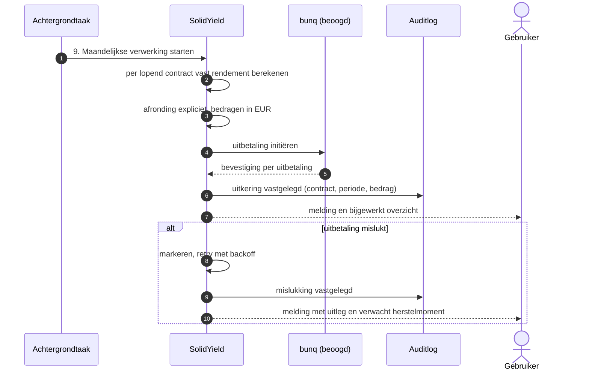
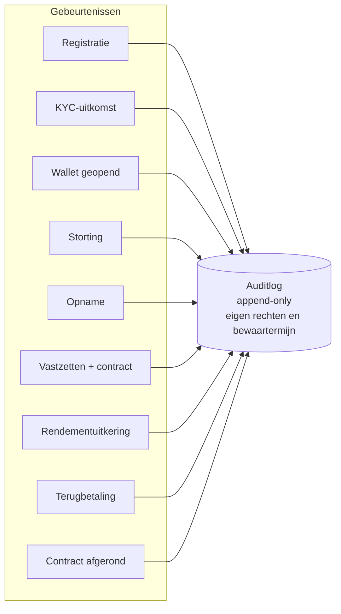

# ADR-0008: Geld- en contractstroom

* **Status:** **Voorgesteld** — wacht op validatie door Compliance en een gespecialiseerde
  financieel-regulatoire jurist
* **Datum:** 2026-08-05
* **Beslissers:** Product Owner (procesinrichting), Tech lead
* **Geraadpleegd:** Compliance, Privacy, Security

> [!IMPORTANT]
> Deze ADR beschrijft **wat er gebeurt** in twaalf stappen, van accountaanmaak tot
> terugbetaling. Zij bevat **geen** juridische kwalificatie en presenteert **geen**
> vergunning als feit. De regulatoire beoordeling loopt via
> [ADR-0007](0007-vergunningplicht-en-rol-in-de-keten.md) en
> [`../../compliance/regulatory-decisions.md`](../../compliance/regulatory-decisions.md).
> Besluit 4 in [`../../../README.md`](../../../README.md#10-openstaande-beslissingen-en-placeholders)
> blijft open.

## Doel

De geld- en contractstroom zo concreet vastleggen dat drie partijen er hetzelfde uit
lezen: het bouwende team, Compliance, en de externe jurist. Diagrammen dwingen af dat
onduidelijkheden zichtbaar worden vóórdat er code is.

## Context

Uit [ADR-0007](0007-vergunningplicht-en-rol-in-de-keten.md): de gebruiker heeft vrij saldo
in een wallet en, na vastzetten, een contractuele vordering op SolidYield. De geldstroom
loopt via de beoogde betaalpartners Mollie (iDEAL/SEPA) en bunq (IBAN, uitbetalingen,
reconciliatie). Beide rollen zijn **beoogd**, niet contractueel vastgelegd (RD-22).

**Productparameters** zoals vastgesteld door de Product Owner:

| Parameter | Waarde |
|---|---|
| Looptijden | 3, 6, 12, 24, 36 en 60 maanden |
| Minimum inleg | € 50 |
| Maximum inleg | geen vastgesteld maximum |
| Rendement | **vast rendement**, maandelijks uitgekeerd |
| Terugbetaling | volledige inleg aan het einde van de looptijd |
| Doelgroep MVP | Nederlandse consumenten, zzp'ers en rechtspersonen — start uitsluitend met een **besloten testgroep** |

> De term is overal **vast rendement**. "Rente" wordt alleen gebruikt waar letterlijk wordt
> verwezen naar historische documentatie of het oorspronkelijke ondernemingsplan.

## Deelnemers in de diagrammen

| Naam | Rol |
|---|---|
| `G` | Gebruiker |
| `SY` | SolidYield (applicatie, walletadministratie, contractadministratie) |
| `M` | Mollie — *beoogd*: iDEAL/SEPA |
| `B` | bunq — *beoogd*: IBAN, uitbetalingen, reconciliatie |
| `KYC` | KYC/AML-proces — fase 1 bij SolidYield zelf; fase 2 externe partner (roadmap) |
| `AUD` | Auditlog (append-only) |

---

## 1–3. Account aanmaken, KYC en wallet openen

```mermaid
sequenceDiagram
    autonumber
    actor G as Gebruiker
    participant SY as SolidYield
    participant KYC as KYC/AML
    participant AUD as Auditlog

    G->>SY: 1. Account aanmaken (e-mail, wachtwoord, MFA)
    SY->>AUD: registratie vastgelegd
    SY-->>G: account actief, nog geen wallet

    G->>SY: 2. Identificatiegegevens aanleveren
    SY->>KYC: verificatie starten (fase 1: intern)
    KYC-->>SY: uitkomst: geaccepteerd / afgewezen / nader onderzoek
    SY->>AUD: uitkomst en tijdstip vastgelegd

    alt geaccepteerd
        SY->>SY: 3. Wallet openen, saldo € 0,00
        SY->>AUD: wallet geopend
        SY-->>G: wallet beschikbaar
    else afgewezen of nader onderzoek
        SY-->>G: geen wallet; uitleg en bezwaarmogelijkheid
    end
```

**Aandachtspunten**

* De wallet wordt **pas** geopend na een positieve KYC-uitkomst. Faalstand is dicht.
* Welke identificatie- en verificatieverplichtingen precies gelden, staat open in **RD-05**.
  Fase 1 legt de verantwoordelijkheid bij SolidYield; fase 2 (externe partner in het
  onboardingproces) is een **roadmapbesluit, geen huidige implementatie**.
* Doelgroep MVP omvat ook zzp'ers en rechtspersonen; verificatie van een rechtspersoon
  verloopt anders dan die van een consument. Uit te werken bij het onboardingontwerp.

---

## 4–5. Geld storten en vrij saldo



**Aandachtspunten**

* Vrij saldo wordt pas bijgeschreven na bevestigde ontvangst — niet op de statusmelding
  alleen. Dat vraagt idempotente verwerking en een expliciete reconciliatiestap.
* De wallet kent **geen** P2P-betalingen en **geen** betalingen aan derden. Opnemen kan
  uitsluitend naar de eigen tegenrekening van de gebruiker.
* Of deze inrichting betekent dat de wallet buiten het bereik van betaaldienstregelgeving
  valt, staat open in **RD-17**.

### Opnemen van vrij saldo



---

## 6–8. Vastzetten, contract genereren en investeren



**Aandachtspunten**

* Het bevestigingsscherm is het moment waarop PD-1 wordt gehaald of gemist: de gebruiker
  moet daarna kunnen benoemen welk bedrag wanneer wordt uitgekeerd **en welk risico eraan
  vastzit**. Het risico is debiteurenrisico op SolidYield, niet marktrisico.
* De beoogde positie bij faillissement is **concurrent schuldeiser**. Dat hoort begrijpelijk
  op dit scherm te staan; hoe die informatie luidt, hangt af van **RD-20** en **RD-21**.
* **Administratieve vermogensscheiding** is een boekhoudkundige maatregel. Of zij bescherming
  biedt bij faillissement is een juridische vraag (**RD-20**) — deze ADR neemt daar geen
  standpunt over in.
* Vastzetten is onomkeerbaar tot de einddatum. Dat is een harde grens die vóór bevestiging
  expliciet moet zijn.
* Er is **geen vastgesteld maximum** op de inleg. Zie risico A-5 in
  [ADR-0007](0007-vergunningplicht-en-rol-in-de-keten.md): drempelbedragen kunnen relevant
  zijn voor een eventuele vrijstelling (RD-01).

---

## 9. Maandelijkse rendementuitkering



**Aandachtspunten**

* De verwerking is **idempotent**: een herhaalde run mag nooit dubbel uitkeren.
* Afronding is expliciet en getest — dit valt onder DoD-criterium C4 (geldstromen).
* Uitkeringen komen uit het vermogen van SolidYield, niet uit het vastgezette bedrag van de
  gebruiker zelf. Dat onderscheid is relevant voor RD-19 (kapitaalpositie).

---

## 10–11. Einde looptijd en terugbetaling inleg

```mermaid
sequenceDiagram
    autonumber
    participant JOB as Achtergrondtaak
    participant SY as SolidYield
    participant B as bunq (beoogd)
    participant AUD as Auditlog
    actor G as Gebruiker

    JOB->>SY: 10. Einddatum bereikt
    SY->>SY: laatste rendementperiode afsluiten
    SY->>SY: 11. Terugbetaling volledige inleg bepalen
    SY->>B: uitbetaling inleg initiëren
    B-->>SY: bevestiging
    SY->>SY: contract sluiten; status afgerond
    SY->>AUD: terugbetaling en contractafsluiting vastgelegd
    SY-->>G: bevestiging; bedrag terug als vrij saldo of naar tegenrekening

    Note over G,SY: Bestemming van de terugbetaling —<br/>vrij saldo of tegenrekening —<br/>is een ontwerpkeuze, nog niet vastgesteld
```

**Aandachtspunten**

* De terugbetaling van de volledige inleg is een **contractuele** verplichting van
  SolidYield. Zij is niet gegarandeerd door een derde partij en niet gedekt door een
  depositogarantie; dat is precies het debiteurenrisico uit risico V-1 in de productvisie.
* Of de terugbetaling standaard in de wallet landt of direct naar de tegenrekening gaat, is
  nog **niet besloten**. Beide hebben gevolgen voor RD-17 (hoe lang staat geld stil in de
  wallet) en voor de gebruikerservaring.

---

## 12. Audittrail



Elke gebeurtenis legt minimaal vast: **wat**, **wanneer**, **welk contract of welke
walletmutatie**, **welk bedrag**, en **welke actor** (gebruiker, systeem, medewerker).

**Aandachtspunten**

* De audittrail is append-only, staat apart van applicatielogging en heeft eigen rechten en
  een eigen bewaartermijn (zie [`../architecture-overview.md`](../architecture-overview.md) §6).
* De bewaartermijn is **nog niet vastgesteld** — **RD-12**, werkhypothese `[1–7 jaar]`.
* Logs bevatten geen wachtwoorden, tokens of onnodige persoonsgegevens. Bedragen en
  contractnummers horen wél in de audittrail, want zonder die gegevens is een geldstroom
  niet reconstrueerbaar.

---

## Gevolgen

**Positief**

* Eén beschrijving waar team, Compliance en jurist naar kunnen wijzen.
* De scheiding tussen vrij saldo en vastgezet bedrag is expliciet en toetsbaar.
* Elke geldstroom heeft een auditmoment.

**Negatief**

* De diagrammen tonen Mollie en bunq in rollen die nog niet contractueel vastliggen; bij
  een andere rolverdeling moeten zij worden herzien (RD-22, risico A-4).
* Twee ontwerpkeuzes zijn bewust opengelaten: bestemming van de terugbetaling, en de
  verwerking van rechtspersonen bij onboarding.

## Open punten uit deze ADR

| # | Punt | Waar belegd |
|---|---|---|
| 1 | Bestemming terugbetaling: wallet of tegenrekening | ontwerp, raakt RD-17 |
| 2 | Onboarding van zzp'ers en rechtspersonen | ontwerp, raakt RD-05 |
| 3 | Bewaartermijn audittrail | RD-12 |
| 4 | Kapitaalpositie voor uitkeringen en terugbetaling | RD-19 |
| 5 | Definitieve rolverdeling betaalpartners | RD-22 |

## Gerelateerde besluiten

* Werkt uit: [ADR-0007](0007-vergunningplicht-en-rol-in-de-keten.md)
* Randvoorwaarde: [ADR-0006](0006-dataresidency-en-opslaglocatie.md)
* Registervragen: `RD-05`, `RD-12`, `RD-17`, `RD-19`, `RD-20`, `RD-21`, `RD-22`

## Herzieningsmoment

Bij elke wijziging in de rolverdeling met betaalpartners, bij het antwoord op RD-17, en
vóór de eerste geldstroom van echte gebruikers.
