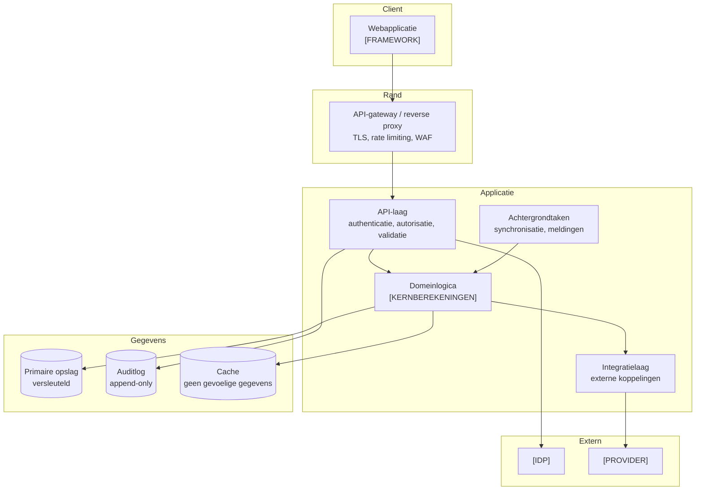

# Architectuuroverzicht

Beschrijft de hoofdcomponenten van SolidYield en hoe zij samenwerken (C4 niveau 2).

> **Status:** sjabloon met een bewust eenvoudige startarchitectuur. Kies pas complexere
> patronen wanneer een concreet probleem daarom vraagt, en leg dat vast in een ADR.

> **Gerelateerd:** [`architecture-principles.md`](architecture-principles.md) (de kaders) ·
> [`system-context.md`](system-context.md) · [`adr/README.md`](adr/README.md)

## 1. Uitgangspunten

1. **Begin eenvoudig.** Een goed gestructureerde, modulaire applicatie ("modulith")
   volstaat voor een MVP. Microservices lossen organisatieproblemen op die dit team nog
   niet heeft, en brengen securitycomplexiteit mee.
2. **Scheiding van verantwoordelijkheden.** Domeinlogica staat los van infrastructuur.
3. **Elke laag valideert.** Vertrouw nooit invoer uit een vorige laag.
4. **Alles wat geld of gegevens raakt, is auditbaar.**
5. **Faalstand is dicht:** bij twijfel weigeren, niet toestaan.

## 2. Componenten

| Component | Verantwoordelijkheid | Aandachtspunten |
|---|---|---|
| Webapplicatie | presentatie, toegankelijkheid, begrijpelijke taal | geen bedrijfsregels; geen gevoelige gegevens in localStorage |
| API-gateway | TLS-terminatie, rate limiting, basisfiltering | eerste verdedigingslinie |
| API-laag | authenticatie, autorisatie, invoervalidatie, foutafhandeling | autorisatie **op objectniveau** |
| Domeinlogica | berekeningen, regels, limieten | volledig unit-getest; afronding expliciet |
| Integratielaag | koppelingen met `[PROVIDER]` | time-outs, retries met backoff, circuit breaker, mock in test |
| Achtergrondtaken | synchronisatie, meldingen | idempotent; foutafhandeling zichtbaar |
| Primaire opslag | gegevens van gebruikers | encryptie in rust, minimale rechten, back-ups |
| Auditlog | wie deed wat, wanneer | append-only, apart bewaard, andere rechten |
| Cache | prestaties | nooit gevoelige gegevens zonder noodzaak; korte TTL |

## 3. Authenticatie en autorisatie

| Onderwerp | Keuze (voorstel) | Status |
|---|---|---|
| Authenticatie | OIDC via `[IDP]`, authorization code flow met PKCE | te besluiten (ADR) |
| MFA | verplicht voor inloggen en gevoelige handelingen | vast uitgangspunt |
| Sessies | korte levensduur (`[15]` min inactiviteit), httpOnly + secure + SameSite cookies, herauthenticatie bij gevoelige acties | voorstel |
| Autorisatie | rolgebaseerd (gebruiker, support, beheerder) **plus** eigenaarschapscontrole per object | vast uitgangspunt |
| Machine-to-machine | OAuth client credentials of mTLS; geen gedeelde statische sleutels | voorstel |

Uitwerking: [`../security/access-control.md`](../security/access-control.md).

## 4. Opslag

| Soort gegeven | Waar | Encryptie | Bewaartermijn |
|---|---|---|---|
| Accountgegevens | primaire opslag | in rust + in transport | zolang het account bestaat + `[termijn]` |
| Financiële gegevens | primaire opslag | in rust; gevoelige velden aanvullend op veldniveau | `[termijn]` — **te valideren** |
| Sessies/tokens | cache of opslag | versleuteld, korte TTL | minuten tot uren |
| Auditlog | aparte, append-only opslag | in rust | `[termijn]` — **te valideren** |
| Onderzoeksdata | **buiten** deze systemen | zie privacydocumentatie | `[termijn]` |

## 5. Foutscenario's

| Scenario | Gedrag | Gebruiker ziet |
|---|---|---|
| `[PROVIDER]` niet bereikbaar | circuit breaker, laatst bekende gegevens met tijdstempel | "Gegevens van `[tijd]`; we proberen het opnieuw" |
| Database niet bereikbaar | falen zonder gegevens te tonen; alarmering | neutrale foutpagina zonder technische details |
| Authenticatie faalt | toegang weigeren (faalstand dicht) | duidelijke uitleg, geen informatie over het bestaan van accounts |
| Achtergrondtaak faalt | retry met backoff, daarna dead-letter + alarm | eventueel melding dat gegevens verouderd zijn |
| Onverwachte fout | generieke melding, correlatie-ID | "Er ging iets mis. Code: `[ID]`" — nooit stacktraces |
| Trage respons | time-out en nette afhandeling | laadindicatie, daarna uitleg |

**Regel:** foutmeldingen lekken nooit interne details, sleutels, querygegevens,
persoonsgegevens of het bestaan van andermans accounts.

## 6. Observability

* **Logs:** gestructureerd (JSON), met correlatie-ID, **zonder** persoonsgegevens,
  bedragen of tokens.
* **Metrics:** latency, foutratio, doorvoer, mislukte inlogpogingen, mislukte transacties.
* **Traces:** over componentgrenzen, met correlatie-ID.
* **Auditlog:** apart van applicatielogging, met een eigen bewaartermijn en eigen rechten.

Zie [`../operations/monitoring.md`](../operations/monitoring.md).

## 7. Schaalbaarheid

| Aspect | Startpunt | Groeipad |
|---|---|---|
| Applicatie | stateless, horizontaal schaalbaar | automatisch schalen |
| Database | één primaire instantie met back-ups | leesreplica's, later partitionering |
| Achtergrondtaken | eenvoudige wachtrij | aparte workers per taaktype |
| Cache | optioneel | pas toevoegen bij een aangetoond knelpunt |

Optimaliseer pas op basis van meting, niet op verwachting.

## 8. Openstaande beslissingen

| # | Beslissing | Eigenaar | Vastleggen als |
|---|---|---|---|
| 1 | Technologiestack en runtime | Tech lead | ADR |
| 2 | Cloudprovider en regio | Tech lead + Compliance | ADR |
| 3 | Identiteitsprovider en MFA-methode | Security | ADR |
| 4 | Databasekeuze en encryptiestrategie | Tech lead + Security | ADR |
| 5 | Monolith of opsplitsing | Tech lead | ADR |
| 6 | Wachtrij-/taakmechanisme | Tech lead | ADR |
