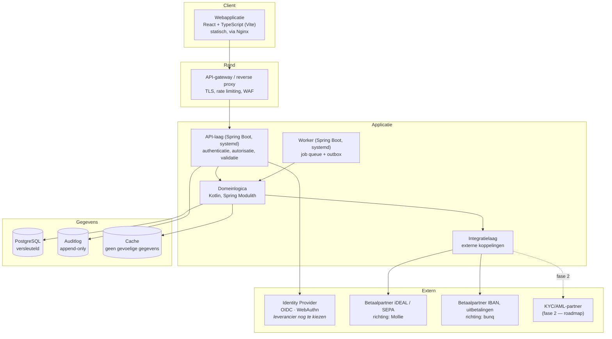

# Architectuuroverzicht

Beschrijft de hoofdcomponenten van SolidYield en hoe zij samenwerken (C4 niveau 2).

> **Status:** de technologiestack en hosting zijn vastgesteld in besluit 5 —
> [ADR-0002](adr/0002-technologiestack.md) en [ADR-0003](adr/0003-cloudprovider.md).
> Bewust eenvoudig: een **modulaire monoliet** op **twee TransIP VPS'en**, zonder
> containers of orkestratie. Kies pas complexere patronen wanneer een concreet probleem
> daarom vraagt, en leg dat vast in een ADR.

> **Gerelateerd:** [`architecture-principles.md`](architecture-principles.md) (de kaders) ·
> [`system-context.md`](system-context.md) · [`adr/README.md`](adr/README.md)

## 1. Uitgangspunten

1. **Begin eenvoudig.** Een goed gestructureerde, modulaire applicatie ("modulith")
   volstaat voor een MVP. Microservices lossen organisatieproblemen op die dit team nog
   niet heeft, en brengen securitycomplexiteit mee.
2. **Scheiding van verantwoordelijkheden.** Domeinlogica staat los van infrastructuur.
3. **Elke laag valideert.** Vertrouw nooit invoer uit een vorige laag.
4. **Alles wat geld of gegevens raakt, is auditbaar.**
5. **Faalstand is dicht:** bij twijfel weigeren, niet toestaan.

## 2. Componenten

| Component | Verantwoordelijkheid | Aandachtspunten |
|---|---|---|
| Webapplicatie | presentatie, toegankelijkheid, begrijpelijke taal | geen bedrijfsregels; geen gevoelige gegevens in localStorage |
| API-gateway | TLS-terminatie, rate limiting, basisfiltering | eerste verdedigingslinie |
| API-laag | authenticatie, autorisatie, invoervalidatie, foutafhandeling | autorisatie **op objectniveau** |
| Domeinlogica | berekeningen, regels, limieten | volledig unit-getest; afronding expliciet; **geen floating point** — integer minor units of een gecontroleerd decimaltype |
| Integratielaag | koppelingen met vergunninghoudende betaalpartners en later een KYC/AML-partner | time-outs, retries met backoff, circuit breaker, idempotentie, sandbox en mock in test; koppelvlakken zijn **implementatieaannames** tot de contracten rond zijn |
| Worker (achtergrondtaken) | job queue, outbox, meldingen | eigen systemd-proces uit hetzelfde artifact; `FOR UPDATE SKIP LOCKED`; retries met backoff, dead-letter; **aflevering is at-least-once**, dus handlers zijn verplicht idempotent |
| Primaire opslag | gegevens van gebruikers | encryptie in rust, minimale rechten, back-ups |
| Auditlog | wie deed wat, wanneer | append-only, apart bewaard, andere rechten |
| Cache | prestaties | nooit gevoelige gegevens zonder noodzaak; korte TTL |

### Modules

Modulaire monoliet met **Spring Modulith**; grenzen worden in tests afgedwongen. Modules:
`identity` · `customer` · `compliance` · `product` · `contract` · `ledger` · `payment` ·
`servicing` · `reconciliation` · `reporting` · `notification` · `document` ·
`administration` · `audit`. Elke module heeft een publieke API, eigen packagegrenzen, eigen
tests, eigen migraties en expliciete domeinevents.

**`identity` is een zelfstandige module** ([ADR-0004](adr/0004-identity-and-access-management.md)).
Zij levert uitsluitend publieke interfaces aan `customer`, `compliance`, `notification`,
`administration` en `audit`, en communiceert **nooit rechtstreeks met `ledger` of
`reconciliation`**. Koppeling met de Identity Provider loopt via één **adapter**: dat is de
enige plek waar leveranciersspecifieke code mag staan, zodat de provider vervangbaar blijft
zonder wijziging aan de domeinlogica. Een architectuurtest bewaakt die grens (C-36).

**Migraties per module zonder versieconflicten.** Elke module heeft een eigen
Flyway-locatie (`classpath:db/migration/<module>`), maar er is **één gedeelde
schemahistorie** per database. Versienummers zijn daarom **globaal uniek**, niet uniek per
module: `V<jjjjMMddHHmm>__<module>_<beschrijving>.sql`. Een CI-check faalt bij dubbele
versienummers over alle modulelocaties heen. Uitwerking en het overwogen alternatief
(schema per module) staan in [ADR-0002](adr/0002-technologiestack.md).

### Kerncomponenten van het domein

| Component | Verantwoordelijkheid | Aandachtspunten |
|---|---|---|
| **Walletadministratie** | vrij beschikbaar saldo per gebruiker; storten, opnemen naar de eigen tegenrekening, vastzetten | geen P2P-betalingen, geen betalingen aan derden; administratieve vermogensscheiding; idempotente verwerking |
| **Contractadministratie** | digitale contracten met looptijd (3, 6, 12, 24, 36 of 60 maanden), vast rendement, einddatum en terugbetaling | vastzetten is onomkeerbaar tot de einddatum; elke mutatie in de audittrail; afronding expliciet en getest |
| **Ledger** | immutable double-entry boekhouding | append-only; geen updates of deletes; correcties uitsluitend via tegenboekingen; idempotency keys en correlation IDs; via jOOQ of expliciete SQL, **geen generieke CRUD** |
| **Beheerinterface** | klantbeheer, KYC, betalingen, reconciliation, audit, rapportages | uitsluitend via **WireGuard**; **maker-checker**; **directe databasecorrecties zijn verboden** |

Geld- en contractstroom met sequencediagrammen:
[`adr/0008-geld-en-contractstroom.md`](adr/0008-geld-en-contractstroom.md). SolidYield is de
contractspartij en houdt de wallet.

De MVP is ontworpen voor integratie met **vergunninghoudende betaalpartners**. De eerste
implementatierichting richt zich op **Mollie** voor iDEAL/SEPA en **bunq** voor
IBAN-functionaliteit, uitbetalingen en reconciliatie. De **definitieve selectie en
rolverdeling worden contractueel en regulatoir vastgesteld** (RD-22). Een betaalpartner is
**geen productuitgever** en draagt het terugbetalingsrisico niet; dat blijft bij SolidYield,
ongeacht welke partij wordt geselecteerd.

> De gekozen productinrichting kan vergunningplichtig zijn. De toepasselijke wettelijke
> grondslag wordt vastgesteld door Compliance (RD-23 t/m RD-27). Tot die bevestiging draait
> de MVP met sandboxbetalingen en synthetische data — zie
> [`adr/0007-vergunningplicht-en-rol-in-de-keten.md`](adr/0007-vergunningplicht-en-rol-in-de-keten.md).

## 3. Authenticatie en autorisatie

Vastgesteld in **besluit 8** ([ADR-0004](adr/0004-identity-and-access-management.md)).

| Onderwerp | Keuze | Status |
|---|---|---|
| Authenticatiemiddelen (klanten) | **passkeys/WebAuthn als primaire methode**, e-mailadres, **TOTP**, veilige sessiecookies; wachtwoord uitsluitend als **fallback** zolang operationeel nodig | vastgesteld ([ADR-0004](adr/0004-identity-and-access-management.md)) |
| Wachtwoordopslag (klanten) | **Argon2id** wanneer SolidYield zelf wachtwoorden opslaat; voert de Identity Provider het wachtwoordbeheer uit, dan moet die **aantoonbaar minimaal een gelijkwaardig beveiligingsniveau** bieden | vastgesteld als **voorwaardelijke eis** — geen onvoorwaardelijke implementatiekeuze |
| Medewerkers | **MFA verplicht**, individuele accounts, voorkeur voor passkeys en hardware security keys; TOTP uitsluitend als fallback | vastgesteld |
| Identiteitsprovider | externe **OIDC**-provider met OAuth 2.1, WebAuthn, MFA, RBAC, session- en device management, audit logging en SCIM-provisioning. **Leverancieronafhankelijk**: koppeling via een adapter, geen leveranciersspecifieke code in domeinmodules | model **vastgesteld**; **leverancierskeuze nog open** (Keycloak is uitsluitend MVP-referentie) |
| MFA | verplicht voor inloggen en gevoelige handelingen; hardware security keys of hardware-backed passkeys bij verhoogde rechten | vastgesteld |
| Sessies | korte levensduur (`[15]` min inactiviteit), httpOnly + secure + SameSite cookies, **sessierotatie**, **centrale intrekking**, herauthenticatie bij gevoelige acties; gebruikers kunnen actieve sessies inzien en beëindigen | vastgesteld |
| Autorisatie | **RBAC, afgedwongen in de servicelaag** — niet in controllers, niet uitsluitend in de frontend — **plus** eigenaarschapscontrole per object. ABAC kan later worden toegevoegd zonder RBAC te vervangen | vastgesteld |
| Niet toegestaan | **SMS als primaire MFA** · **social login** · **gedeelde accounts** · hardcoded accounts · embedded secrets · autorisatie uitsluitend in de frontend · leveranciersspecifieke IAM-code in domeinmodules | vastgesteld |
| Machine-to-machine | OAuth client credentials of mTLS; geen gedeelde statische sleutels | voorstel |

Uitwerking: [`../security/access-control.md`](../security/access-control.md) en
[ADR-0004](adr/0004-identity-and-access-management.md).

## 4. Opslag

| Soort gegeven | Waar | Encryptie | Bewaartermijn |
|---|---|---|---|
| Accountgegevens | PostgreSQL | in rust + in transport | zolang het account bestaat + `[termijn]` |
| Financiële gegevens en ledger | PostgreSQL | in rust; gevoelige velden aanvullend op veldniveau | `[termijn]` — **te valideren** |
| Documenten en exports | TransIP Object Store, **unieke buckets per omgeving** (zie hieronder) | in rust; versioning en lifecycle policies | `[termijn]` — **te valideren** |
| Sessies/tokens | cache of opslag | versleuteld, korte TTL | minuten tot uren |
| Auditlog | aparte, append-only opslag | in rust | `[termijn]` — **te valideren** |
| Onderzoeksdata | **buiten** deze systemen | zie privacydocumentatie | `[termijn]` |

### Object Store: unieke buckets en gescheiden toegang per omgeving

Generieke bucketnamen zijn **niet toegestaan**: bij een verkeerd geconfigureerde omgeving
raakt een generieke naam stilzwijgend de verkeerde bucket.

| Omgeving | Buckets |
|---|---|
| Productie | `solidyield-production-documents` · `solidyield-production-exports` · `solidyield-production-backups` |
| Test | `solidyield-test-documents` · `solidyield-test-exports` · `solidyield-test-backups` |

Productie en test gebruiken **afzonderlijke** Object Store-credentials, access keys,
endpoints/accounts of IAM-principals, encryptiesleutels en lifecycle-/retentieconfiguraties.

> **Harde eis:** een verkeerde *productie*credential mag technisch **geen** toegang geven
> tot test, en omgekeerd. De scheiding mag niet berusten op een correct ingevulde
> bucketnaam alleen; zij moet op autorisatieniveau afdwingbaar zijn. Zie
> [ADR-0003](adr/0003-cloudprovider.md), control **C-24** en dreiging **T-27**.

De frontend krijgt **nooit** object-storagecredentials; toegang loopt via de backend, die
kortlevende presigned URL's uitgeeft.

## 5. Foutscenario's

| Scenario | Gedrag | Gebruiker ziet |
|---|---|---|
| Betaalpartner niet bereikbaar | circuit breaker; **geen** saldomutatie zonder bevestigde ontvangst | "De betaling is nog niet bevestigd; we proberen het opnieuw" |
| Uitbetaling mislukt | markeren, retry met backoff, daarna alarm; nooit stilzwijgend overslaan | melding met uitleg en verwacht herstelmoment |
| Database niet bereikbaar | falen zonder gegevens te tonen; alarmering | neutrale foutpagina zonder technische details |
| Authenticatie faalt | toegang weigeren (faalstand dicht) | duidelijke uitleg, geen informatie over het bestaan van accounts |
| Achtergrondtaak faalt | retry met backoff, daarna dead-letter + alarm | eventueel melding dat gegevens verouderd zijn |
| Onverwachte fout | generieke melding, correlatie-ID | "Er ging iets mis. Code: `[ID]`" — nooit stacktraces |
| Trage respons | time-out en nette afhandeling | laadindicatie, daarna uitleg |

**Regel:** foutmeldingen lekken nooit interne details, sleutels, querygegevens,
persoonsgegevens of het bestaan van andermans accounts.

## 6. Observability

* **Logs:** gestructureerd (JSON), met correlatie-ID, **zonder** persoonsgegevens,
  bedragen of tokens.
* **Metrics:** latency, foutratio, doorvoer, mislukte inlogpogingen, mislukte transacties.
* **Traces:** over componentgrenzen, met correlatie-ID.
* **Auditlog:** apart van applicatielogging, met een eigen bewaartermijn en eigen rechten.

Zie [`../operations/monitoring.md`](../operations/monitoring.md).

## 7. Schaalbaarheid

| Aspect | Startpunt | Groeipad |
|---|---|---|
| Applicatie | stateless, horizontaal schaalbaar | automatisch schalen |
| Database | één primaire instantie met back-ups | leesreplica's, later partitionering |
| Achtergrondtaken | eenvoudige wachtrij | aparte workers per taaktype |
| Cache | optioneel | pas toevoegen bij een aangetoond knelpunt |

Optimaliseer pas op basis van meting, niet op verwachting.

## 8. Openstaande beslissingen

| # | Beslissing | Eigenaar | Vastleggen als |
|---|---|---|---|
| 0 | **Wettelijke grondslag** om het besloten bedrijfsmodel uit te voeren — blokkeert echte klantgelden en productiegebruik | Compliance | RD-23 t/m RD-27; model zelf besloten in [ADR-0007](adr/0007-vergunningplicht-en-rol-in-de-keten.md) |
| 1 | ~~Technologiestack en runtime~~ | Tech lead | ✅ [ADR-0002](adr/0002-technologiestack.md) |
| 2 | ~~Cloudprovider en hosting~~ | Tech lead + Compliance | ✅ [ADR-0003](adr/0003-cloudprovider.md) |
| 3 | ~~Identity & Access Management~~ | Security Architect + Tech lead | ✅ [ADR-0004](adr/0004-identity-and-access-management.md) — leverancieronafhankelijk model |
| 3a | **Definitieve keuze van de Identity Provider** — valt buiten besluit 8 | Security Architect + Tech lead + Privacy | ADR-0004 vervolgactie 5 |
| 4 | Encryptie- en sleutelbeheerstrategie | Tech lead + Security | ADR-0005 |
| 5 | ~~Monolith of opsplitsing~~ | Tech lead | ✅ modulaire monoliet, [ADR-0002](adr/0002-technologiestack.md) |
| 6 | ~~Wachtrij-/taakmechanisme~~ | Tech lead | ✅ PostgreSQL job queue + outbox, [ADR-0002](adr/0002-technologiestack.md) |
| 7 | Secundaire locatie voor back-up en disaster recovery, met onderbouwde scheiding | Tech lead + Ops | [ADR-0006](adr/0006-dataresidency-en-opslaglocatie.md) vervolgactie 3 |
