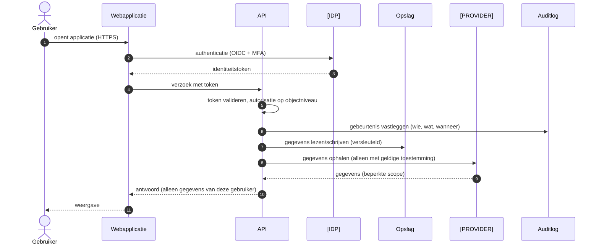

# Gegevensstromen

Beschrijft welke gegevens waarheen stromen, met welk doel en met welke bescherming. Dit
document is de basis voor het [threat model](threat-model.md), de
[gegevensclassificatie](../privacy/data-classification.md) en de DPIA.

## 1. Overzicht

## 2. Stromen per doel

| # | Stroom | Gegevens | Doel | Grondslag (voorlopig) | Bescherming |
|---|---|---|---|---|---|
| DF-1 | Gebruiker → applicatie | inloggegevens, MFA-code | authenticatie | uitvoering overeenkomst | TLS, geen logging van geheimen, rate limiting |
| DF-2 | Applicatie → `[IDP]` | identiteitsclaims | authenticatie | uitvoering overeenkomst | OIDC, PKCE, korte tokenlevensduur |
| DF-3 | Gebruiker → applicatie | profielgegevens | account beheren | uitvoering overeenkomst | validatie, minimalisatie |
| DF-4 | Applicatie ↔ `[PROVIDER]` | financiële gegevens | het kerninzicht leveren | **toestemming** (intrekbaar) | scopebeperking, tokens in secrets manager, mTLS/OAuth |
| DF-5 | Applicatie → opslag | financiële en profielgegevens | dienstverlening | uitvoering overeenkomst | encryptie in rust, least privilege |
| DF-6 | Applicatie → auditlog | wie deed wat, wanneer | aantoonbaarheid, misbruikdetectie | gerechtvaardigd belang / verplichting — **te valideren** | append-only, aparte rechten |
| DF-7 | Applicatie → monitoring | technische telemetrie | beschikbaarheid | gerechtvaardigd belang | **geen persoonsgegevens**, geen bedragen |
| DF-8 | Applicatie → berichtendienst | e-mailadres, neutrale inhoud | transactionele berichten | uitvoering overeenkomst | geen financiële details in de berichtinhoud |
| DF-9 | Support → applicatie | inzage in gegevens | hulp bij een vraag | gerechtvaardigd belang | minimale rechten, aanleiding vastleggen, volledig geaudit |
| DF-10 | Gebruiker → export/verwijdering | eigen gegevens | rechten van betrokkenen | wettelijke verplichting | identiteitscontrole, veilige aflevering |

> Alle grondslagen zijn **voorlopig** en moeten worden bevestigd door de privacy-
> verantwoordelijke; regulatoire conclusies zijn **te valideren door een bevoegde
> specialist**.

## 3. Wat wij bewust **niet** doen

* Geen financiële gegevens naar analytics of marketing.
* Geen persoonsgegevens in applicatielogs, URL's, foutmeldingen of monitoring.
* Geen productiedata in test-, demo- of testgroepomgevingen.
* Geen doorgifte naar landen buiten de **EER** — uitgesloten door ADR-0006. Toegang vanuit
  buiten de EER alleen na afzonderlijke privacy- en compliancebeoordeling.
* Geen profilering met rechtsgevolg zonder aparte beoordeling.

## 4. Gegevens in rust

| Opslag | Inhoud | Encryptie | Toegang | Back-up |
|---|---|---|---|---|
| Primaire database | account- en financiële gegevens | in rust (`[KMS]`), gevoelige velden aanvullend | alleen de applicatie, least privilege | dagelijks, versleuteld, hersteltest per kwartaal |
| Auditlog | gebeurtenissen | in rust | schrijven door app, lezen door security | conform bewaartermijn |
| Back-ups | volledige dataset | in rust, aparte sleutel | strikt beperkt, MFA | offsite in één secundaire EER-regio (ADR-0006) |
| Cache | tijdelijke gegevens | in rust waar mogelijk | alleen applicatie | geen |
| Onderzoeksdata | interviewaantekeningen | buiten deze systemen | UX + privacy | volgens onderzoeksbeleid |

## 5. Gegevens in transport

| Traject | Protocol | Extra |
|---|---|---|
| Gebruiker → rand | HTTPS (TLS 1.2+, bij voorkeur 1.3) | HSTS, veilige cookievlaggen |
| Rand → applicatie | TLS binnen het netwerk | netwerkisolatie |
| Applicatie → database | TLS | alleen vanaf toegestane bronnen |
| Applicatie → externe partij | TLS, mTLS waar mogelijk | uitgaande allowlist |
| Beheer → omgeving | versleuteld, MFA, just-in-time | volledig geaudit |

## 6. Bewaartermijnen

Zie [`../privacy/data-retention.md`](../privacy/data-retention.md). Elke stroom die
gegevens opslaat, heeft daar een regel — zonder uitzondering.

## 7. Onderhoud van dit document

Bijwerken bij: elke nieuwe externe koppeling, elke nieuwe gegevenscategorie, elke
wijziging in doel of grondslag, en minimaal elk kwartaal. Wijzigingen lopen via een pull
request met review door privacy en security.
