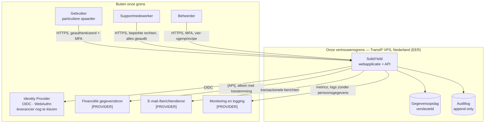

# Systeemcontext

Beschrijft wat SolidYield is, wie het gebruikt en met welke externe partijen het
communiceert. Dit is het hoogste abstractieniveau (C4 niveau 1).

> **Status:** technologiestack, hosting en IAM zijn vastgesteld —
> [ADR-0002](adr/0002-technologiestack.md), [ADR-0003](adr/0003-cloudprovider.md) en
> [ADR-0004](adr/0004-identity-and-access-management.md). De resterende `[PROVIDER]`-velden
> betreffen de financiële gegevensbron, de berichtendienst en monitoring; die keuzes staan
> nog open.

## 1. Contextdiagram

## 2. Gebruikers en externe partijen

| Actor | Type | Doel | Toegang | Aandachtspunt |
|---|---|---|---|---|
| Gebruiker (Nederlandse particuliere spaarder) | mens | eigen financieel inzicht/handelingen | eigen gegevens, na MFA | autorisatie op objectniveau |
| Supportmedewerker | mens | gebruiker helpen | minimale rechten, tijdelijk, altijd geaudit | inzage alleen met aanleiding |
| Beheerder | mens | configuratie en beheer | verhoogde rechten, MFA, vier-ogen | geen toegang tot klantgegevens zonder noodzaak |
| Auditor | mens | controles verifiëren | alleen-lezen op bewijs | geen productiedata |
| Identity Provider | systeem | authenticatie, MFA, passkeys/WebAuthn, sessie- en device management | **OIDC** en OAuth 2.1 via een adapter; geen leveranciersspecifieke code in domeinmodules ([ADR-0004](adr/0004-identity-and-access-management.md)) | leveranciersafhankelijkheid en uitwijk; **leverancier nog niet gekozen** — Keycloak is uitsluitend MVP-referentie |
| Financiële gegevensbron `[PROVIDER]` | systeem | gegevens leveren | token met beperkte scope, intrekbaar | **regulatoir regime te valideren** |
| Berichtendienst | systeem | e-mail/notificaties | API-sleutel in secrets manager | geen gevoelige inhoud in berichten |
| Monitoring `[PROVIDER]` | systeem | beschikbaarheid en fouten | uitgaande telemetrie | geen persoonsgegevens in logs |

## 3. Vertrouwensgrenzen

| # | Grens | Van → naar | Maatregelen |
|---|---|---|---|
| TB-1 | Internet → applicatie | gebruiker → API | TLS 1.2+, WAF/rate limiting, invoervalidatie, authenticatie |
| TB-2 | Applicatie → gegevensopslag | app → database | netwerkisolatie, least-privilege accounts, encryptie in rust |
| TB-3 | Applicatie → externe partij | app → `[PROVIDER]` | uitgaande allowlist, mTLS of OAuth, secrets in een manager |
| TB-4 | Beheer → productie | medewerker → omgeving | MFA, just-in-time toegang, vier-ogen, volledige auditlog |
| TB-5 | Omgevingen onderling | test ↔ productie | **volledig gescheiden**; geen productiedata in test |

## 4. Aannames

| # | Aanname | Consequentie als onjuist |
|---|---|---|
| SA-1 | Opslag en reguliere verwerking van productiegegevens vinden uitsluitend binnen de **EER** plaats; de primaire productieomgeving staat fysiek in **Nederland** op een TransIP VPS, back-up en disaster recovery op één **geografisch gescheiden secundaire locatie binnen de EER** ([ADR-0003](adr/0003-cloudprovider.md), [ADR-0006](adr/0006-dataresidency-en-opslaglocatie.md)) | toegang vanuit derde landen is standaard uitgesloten en alleen mogelijk bij een vooraf goedgekeurde uitzondering |
| SA-2 | Authenticatie wordt **uitbesteed aan een externe OIDC-provider**; de koppeling loopt via één adapter, zodat de leverancier vervangbaar blijft ([ADR-0004](adr/0004-identity-and-access-management.md)) | zelf bouwen betekent aanzienlijk meer securitywerk; leveranciersspecifieke code buiten de adapter maakt vervangen later een herbouwproject |
| SA-3 | Eén logische tenant (geen white label) | multi-tenancy raakt datamodel en autorisatie |
| SA-4 | Wij initiëren geen betalingen in de MVP | zwaarder regulatoir regime — **te valideren** |
| SA-5 | Productie en test draaien op **afzonderlijke VPS'en** en delen niets: geen databases, databasegebruikers, Unix-accounts, secrets, signing keys, buckets, provideraccounts, monitoring, logging of back-ups (ADR-0003). Object storage gebruikt **unieke bucketnamen** per omgeving en afzonderlijke credentials, access keys, endpoints/IAM-principals, encryptiesleutels en lifecycle-/retentieconfiguraties | test is uitsluitend bereikbaar via WireGuard en draait met synthetische data; een productiecredential geeft technisch geen toegang tot test en omgekeerd |

## 5. Nog te beslissen

| Onderwerp | Eigenaar | ADR |
|---|---|---|
| ~~Technologiestack~~ | Tech lead | ✅ [ADR-0002](adr/0002-technologiestack.md) |
| ~~Cloudprovider en regio~~ | Tech lead + Compliance | ✅ [ADR-0003](adr/0003-cloudprovider.md) · [ADR-0006](adr/0006-dataresidency-en-opslaglocatie.md) |
| ~~Identity & Access Management~~ | Security Architect + Tech lead | ✅ [ADR-0004](adr/0004-identity-and-access-management.md) — leverancieronafhankelijk model |
| **Definitieve keuze van de Identity Provider** | Security Architect + Tech lead + Privacy | ADR-0004 vervolgactie 5 — **nog open** |
| Gegevensbron/koppeling | PO + Tech lead | `adr/000X` |
