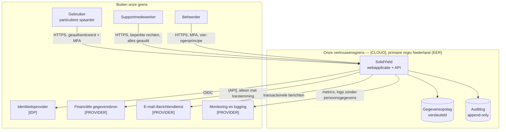

# Systeemcontext

Beschrijft wat SolidYield is, wie het gebruikt en met welke externe partijen het
communiceert. Dit is het hoogste abstractieniveau (C4 niveau 1).

> **Status:** sjabloon. Vul in zodra `[TECH STACK]` en `[CLOUD]` zijn gekozen; leg de
> keuzes vast als ADR.

## 1. Contextdiagram

## 2. Gebruikers en externe partijen

| Actor | Type | Doel | Toegang | Aandachtspunt |
|---|---|---|---|---|
| Gebruiker (Nederlandse particuliere spaarder) | mens | eigen financieel inzicht/handelingen | eigen gegevens, na MFA | autorisatie op objectniveau |
| Supportmedewerker | mens | gebruiker helpen | minimale rechten, tijdelijk, altijd geaudit | inzage alleen met aanleiding |
| Beheerder | mens | configuratie en beheer | verhoogde rechten, MFA, vier-ogen | geen toegang tot klantgegevens zonder noodzaak |
| Auditor | mens | controles verifiëren | alleen-lezen op bewijs | geen productiedata |
| Identiteitsprovider `[IDP]` | systeem | authenticatie en MFA | OIDC | leveranciersafhankelijkheid, uitwijk |
| Financiële gegevensbron `[PROVIDER]` | systeem | gegevens leveren | token met beperkte scope, intrekbaar | **regulatoir regime te valideren** |
| Berichtendienst | systeem | e-mail/notificaties | API-sleutel in secrets manager | geen gevoelige inhoud in berichten |
| Monitoring `[PROVIDER]` | systeem | beschikbaarheid en fouten | uitgaande telemetrie | geen persoonsgegevens in logs |

## 3. Vertrouwensgrenzen

| # | Grens | Van → naar | Maatregelen |
|---|---|---|---|
| TB-1 | Internet → applicatie | gebruiker → API | TLS 1.2+, WAF/rate limiting, invoervalidatie, authenticatie |
| TB-2 | Applicatie → gegevensopslag | app → database | netwerkisolatie, least-privilege accounts, encryptie in rust |
| TB-3 | Applicatie → externe partij | app → `[PROVIDER]` | uitgaande allowlist, mTLS of OAuth, secrets in een manager |
| TB-4 | Beheer → productie | medewerker → omgeving | MFA, just-in-time toegang, vier-ogen, volledige auditlog |
| TB-5 | Omgevingen onderling | test ↔ productie | **volledig gescheiden**; geen productiedata in test |

## 4. Aannames

| # | Aanname | Consequentie als onjuist |
|---|---|---|
| SA-1 | Alle productiegegevens blijven binnen de **EER**; de primaire omgeving staat fysiek in **Nederland** (ADR-0006) | beperkt de providerkeuze; doorgifte buiten de EER is uitgesloten |
| SA-2 | Authenticatie wordt uitbesteed aan `[IDP]` | zelf bouwen betekent aanzienlijk meer securitywerk |
| SA-3 | Eén logische tenant (geen white label) | multi-tenancy raakt datamodel en autorisatie |
| SA-4 | Wij initiëren geen betalingen in de MVP | zwaarder regulatoir regime — **te valideren** |

## 5. Nog te beslissen

| Onderwerp | Eigenaar | ADR |
|---|---|---|
| Technologiestack | Tech lead | `adr/000X` |
| Cloudprovider en regio | Tech lead + Compliance | `adr/000X` |
| Identiteitsprovider en MFA-methode | Security | `adr/000X` |
| Gegevensbron/koppeling | PO + Tech lead | `adr/000X` |
